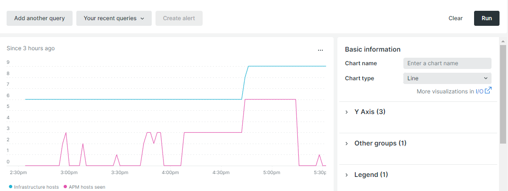

# Automatische Skalierung

Durch die automatische Skalierung werden der Cloud-Infrastruktur automatisch Ressourcen hinzugefügt oder entfernt, um eine optimale Leistung und angemessene Kosten zu gewährleisten. Diese Funktion ist derzeit nur für Projekte verfügbar, die mit einer [skalierten Architektur](scaled-architecture.md) konfiguriert wurden.

## Webserver-Knoten

Die [Webstufe](scaled-architecture.md#web-tier) wird skaliert, um eine Erhöhung der Prozessanforderungen und höhere Traffic-Anforderungen zu berücksichtigen. Derzeit wird die Funktion zur automatischen Skalierung nur horizontal skaliert, indem Webserverknoten hinzugefügt oder entfernt werden.

Ein Ereignis zur automatischen Skalierung tritt auf, wenn CPU-Auslastung und Traffic einen vordefinierten Schwellenwert erreichen:

- **Hinzugefügte Knoten** - CPUs/Kerne aller aktiven Webknoten haben eine Kapazität von 75 % für eine Minute und der Traffic steigt 5 Minuten lang um 20 %.
- **Entfernte Knoten** - CPUs/Kerne aller aktiven Webknoten werden 20 Minuten lang bei 60 % geladen. Knoten werden in der Reihenfolge entfernt, in der sie hinzugefügt wurden.

Die Mindest- und Höchstschwellen werden anhand der vertraglich festgelegten Ressourcengrenzen jedes Händlers bestimmt und festgelegt; dadurch wird das Risiko einer endlosen Skalierung verringert.

## Überwachen von Schwellenwerten mit New Relic

Sie können den [New Relic-Dienst](../monitor/new-relic-service.md) verwenden, um bestimmte Schwellenwerte wie Hostanzahl und CPU-Auslastung zu überwachen. Die folgenden New Relic-Abfragen verwenden eine Variablennotation für `cluster-id` nur zu Beispielzwecken.

>[!TIP]
>
>Eine Referenz zum Erstellen von Abfragen finden Sie unter [NRQL-Syntax, -Klauseln und -Funktionen](https://docs.newrelic.com/docs/query-your-data/nrql-new-relic-query-language/get-started/nrql-syntax-clauses-functions/) in der Dokumentation zu _New Relic_ .
>Verwenden Sie Ihre Abfragen, um ein [New Relic-Dashboard](https://docs.newrelic.com/docs/query-your-data/explore-query-data/dashboards/introduction-dashboards/) zu erstellen.

### Hostanzahl

Die folgende New Relic-Beispielabfrage zeigt die Hostanzahl in der Umgebung:

```sql
SELECT uniqueCount(SystemSample.entityId) AS 'Infrastructure hosts', uniqueCount(Transaction.host) AS 'APM hosts seen' FROM SystemSample, Transaction where (Transaction.appName = 'cluster-id_stg' AND Transaction.transactionType = 'Web') OR SystemSample.apmApplicationNames LIKE '%|cluster-id_stg|%' TIMESERIES SINCE 3 HOURS AGO
```

Im folgenden Screenshot bezieht sich **angezeigte APM-Hosts** auf die Anzahl der Hosts mit Transaktionen, die während des ausgewählten Zeitraums protokolliert wurden.



### CPU-Auslastung

Die folgende New Relic-Beispielabfrage zeigt die CPU-Auslastung für Webknoten:

```sql
SELECT average(cpuPercent) FROM SystemSample FACET hostname, apmApplicationNames WHERE instanceType LIKE 'c%' TIMESERIES SINCE 3 HOURS AGO
```


## Automatische Skalierung aktivieren

Um die automatische Skalierung für Ihr Adobe Commerce-Projekt in der Cloud-Infrastruktur zu aktivieren bzw. zu deaktivieren, senden Sie ein Support-Ticket für Adobe Commerce](https://experienceleague.adobe.com/docs/commerce-knowledge-base/kb/help-center-guide/magento-help-center-user-guide.html#submit-ticket). [ Wählen Sie im Ticket die folgenden Gründe aus:

- **Kontaktgrund**: Anforderung zur Änderung der Infrastruktur
- **Adobe Commerce Infrastructure Contact Reason**: Other Infrastructure Change Request

>[!IMPORTANT]
>
>Die Funktion zur automatischen Skalierung erfasst nicht erwartete Ereignisse. Selbst wenn die automatische Skalierung aktiviert ist, empfiehlt Adobe, weiterhin [ein Adobe Commerce-Supportticket senden](https://experienceleague.adobe.com/docs/commerce-knowledge-base/kb/help-center-guide/magento-help-center-user-guide.html#submit-ticket) zu lassen, wenn Sie ein bevorstehendes Ereignis erwarten.

### Belastungstests

Adobe ermöglicht die automatische Skalierung zuerst im Cloud-Projekt _staging_ -Cluster. Nachdem Sie die Ladevorgänge in Ihrer Umgebung durchgeführt und abgeschlossen haben, aktiviert Adobe die automatische Skalierung auf Ihrem Produktionscluster. Eine Anleitung zum Laden finden Sie unter [Leistungstests](../launch/checklist.md#performance-testing).

### IP-Zulassungsliste

Nach der Aktivierung der automatischen Skalierung stammt der ausgehende Webknoten-Traffic von den IP-Adressen der Dienstknoten. Wenn Sie eine Zulassungsliste mit einem Drittanbieterdienst verwenden, der nicht im Lieferumfang Ihres Adobe Commerce-Cloud-Infrastrukturprojekts enthalten ist, überprüfen Sie die IP-Adressen in der Zulassungsliste des Drittanbieterdienstes .

Beispiel:

- Wenn die Zulassungsliste die IP-Adressen für Ihre Dienstknoten (1, 2 und 3) enthält, ist keine Aktion erforderlich.
- Wenn die Zulassungsliste die IP-Adressen für Ihre Dienstknoten (1, 2 und 3) und Webknoten (4, 5 und 6) - in diesem Fall alle sechs Knoten - enthält, ist keine Aktion erforderlich.
- Wenn die Zulassungsliste die IP-Adressen _nur_ für Ihre Webknoten (4, 5 und 6) enthält, müssen Sie die Zulassungsliste aktualisieren, um die IP-Adressen für die Dienstknoten einzuschließen.
