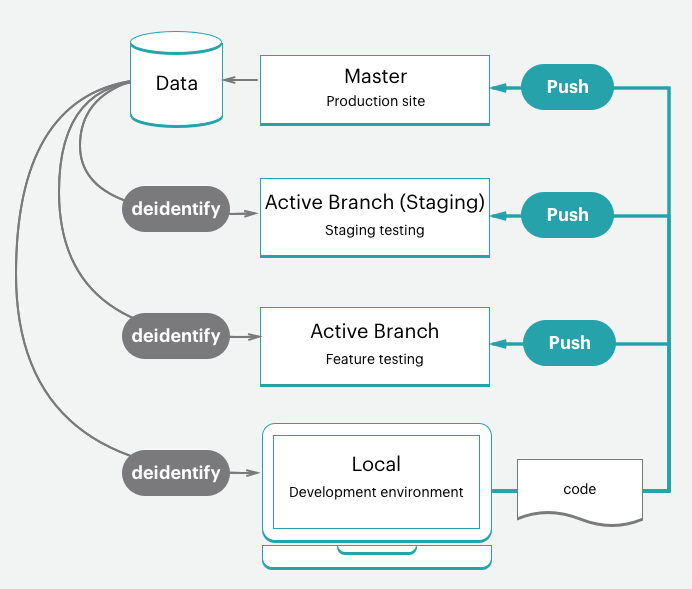
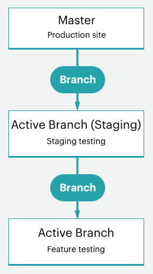
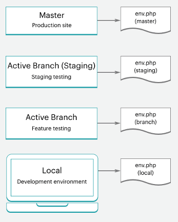

# Workflow für Starterprojekte

Die Adobe Commerce-Cloud-Infrastruktur umfasst ein einzelnes Git-Repository mit einer `master` Zweig für die Produktionsumgebung, der verzweigt werden kann, um eine Staging- und mehrere Integrationsumgebungen für Test- und Entwicklungsarbeiten zu erstellen. Sie können über bis zu vier aktive Umgebungen verfügen, darunter eine `master` Umgebung für Ihren Produktionsserver. Siehe [Starterarchitektur](starter-architecture.md) für einen Überblick.

Folgen Sie für Ihre Umgebungen den Anweisungen unter [!UICONTROL Development > Staging > Production] -Arbeitsablauf zur Entwicklung und Bereitstellung Ihrer Site.

- **Produktionsumgebung (Live-Site)**—Bietet eine vollständige Produktionsumgebung mit allen Diensten, die aus dem Code auf der `master` -Verzweigung.
- **Staging-Umgebung**—Bietet eine vollständige Staging-Umgebung, die mit allen Diensten übereinstimmt, die aus einer Produktionsumgebung erstellt und bereitgestellt wurden. `staging` Zweig, den Sie durch Klonen aus `master`.
- **Integrationsumgebungen**—Stellt bis zu zwei aktive Entwicklungsumgebungen bereit, die Sie aus dem `staging` -Verzweigung. Die `integration` -Umgebung unterstützt keine Drittanbieterdienste wie Fastly und New Relic.

Für Ihre Zweige können Sie jede Entwicklungsmethode anwenden. Beispielsweise können Sie einer Agile-Methode wie dem Scrubbing folgen, um für jeden Sprint Zweige zu erstellen.

Von jedem Sprint aus können Sie für jede Benutzergeschichte Zweige erstellen. Alle Geschichten werden prüfbar. Sie können kontinuierlich mit der Sprint-Verzweigung zusammenführen und diese Verzweigung kontinuierlich überprüfen. Wenn der Sprint endet, können Sie den Sprint-Zweig zu `master` alle Sprint-Änderungen an der Produktion bereitzustellen, ohne einen Prüffehler beheben zu müssen.

## Entwicklungs-Workflow

Die Entwicklung und Implementierung von Starter-Plänen beginnt mit Ihrem ursprünglichen Projekt. Sie erstellen Ihr Projekt mit der &quot;leeren Site&quot;, einem Adobe Commerce-Code-Repository für Cloud-Infrastrukturvorlagen mit vollständig vorbereitetem Speicher. Dadurch wird eine `master` -Verzweigung mit einer Kopie des Codes aus Ihrer Produktionsumgebung.

Der Entwicklungs-Workflow umfasst Folgendes:

- [Klonen und Verzweigung](#clone-and-branch) aus dem `master` erstellen `staging` und Entwicklungszweigen
- [Code entwickeln](#develop-code) und installieren Sie Erweiterungen lokal in einer Entwicklungsverzweigung, einschließlich [!DNL Composer] Updates
- [Konfigurieren](#configure-store) Ihre Store- und Erweiterungseinstellungen
- [Konfiguration generieren](#generate-configuration-management-files) Verwaltungsdateien
- [Push-Code](#push-code-and-test) und -Konfiguration, die für die Erstellung und Bereitstellung von `staging` und `production` Umgebungen



Sie haben auch einige optionale Schritte, die Sie bei der Entwicklung und dem Testen Ihres Codes und Ihrer Store-Daten unterstützen:

- [Beispieldaten installieren](#optional-install-sample-data) in den Speicher
- [Produktionsspeicherdaten abrufen](#optional-pull-production-data) bis zu Umgebungen

Bei diesem Vorgang wird davon ausgegangen, dass Sie Ihre [lokaler Entwicklerarbeitsbereich](../development/overview.md).

### Klonen und Verzweigung

Für ein neues Starter-Planprojekt wird ein `master` -Verzweigung wurde aus Adobe Commerce im Git-Repository der Cloud-Infrastruktur geklont. Um mit der Verzweigung und der Arbeit mit Code zu beginnen, klonen Sie die `master` in Ihre lokale Umgebung verzweigen.

Das Format des Git-Klon-Befehls lautet:

```bash
git fetch origin
```

```bash
git pull origin <environment-ID>
```

Wenn Sie zum ersten Mal mit der Arbeit in Zweigen für Ihr Starter-Projekt beginnen, erstellen Sie eine `staging` -Verzweigung. Dadurch wird eine Codeverzweigung erstellt, die mit der `master` -Verzweigung, die in einer Staging-Umgebung bereitgestellt wird, um Konfigurations- und Codeänderungen vor der Bereitstellung in der Produktionsumgebung zu testen.

Erstellen Sie als Nächstes Zweige aus `staging` um Code zu entwickeln, Erweiterungen hinzuzufügen und Drittanbieterintegrationen zu konfigurieren. Jedes Mal, wenn Sie benutzerdefinierten Code entwickeln, Erweiterungen hinzufügen, in einen Drittanbieterdienst integrieren, in einer Entwicklungsverzweigung arbeiten, die von der `staging` -Verzweigung. Es stehen vier aktive Integrationsumgebungen zur Verfügung. Wenn Sie eine aktive Verzweigung per Push bereitstellen, stellt eine dieser Integrationsumgebungen den Code zum Testen automatisch bereit.

Das Format des Befehls der Git-Verzweigung lautet:

```bash
git checkout <branch-name>
```

Das Format der Cloud-CLI `branch` Befehl:

```bash
magento-cloud environment:branch <environment-name> <parent-environment-ID>
```



### Code entwickeln

Mithilfe der Basisverzweigung von Adobe Commerce im Cloud-Infrastrukturcode können Sie mit der Installation von Erweiterungen, der Entwicklung von benutzerdefiniertem Code, dem Hinzufügen von Designs und vielem mehr beginnen.

Verwenden Sie eine Verzweigungsstrategie für Ihre Entwicklungsarbeit. Die Verwendung einer Verzweigung, um all Ihre Arbeit auf einmal zu erledigen, kann Tests erschweren. Sie können beispielsweise kontinuierliche Integration und Sprint-Methoden anwenden, um zu funktionieren:

- Fügen Sie einige Erweiterungen hinzu und konfigurieren Sie sie mit Ihrer ersten Verzweigung
- Push diesen Code, test und merge an Staging, dann Production
- Vollständige Konfiguration Ihrer Dienste in `services.yaml` und ein Design hinzufügen
- Push diesen Code, test und merge an Staging, dann Production
- Integration mit einem Drittanbieterdienst
- Push diesen Code, test und merge an Staging, dann Production

Bis Ihr Store vollständig erstellt, konfiguriert und startbereit ist. Aber lesen Sie weiter, es gibt viele Optionen für Ihre Store- und Code-Konfiguration.

>[!NOTE]
>
>Schließen Sie noch keine Konfigurationen in Ihrer lokalen Workstation ab.


### Store konfigurieren

Wenn Sie bereit sind, Ihren Store zu konfigurieren, pushen Sie sämtlichen Code an die `integration` Umgebung. Konfigurieren Sie Ihre Speichereinstellungen über den Administrator für die Integrationsumgebung und nicht in Ihrer lokalen Umgebung. Sie können die URL finden, indem Sie **Auf Website zugreifen** im [!DNL Cloud Console]

Die besten Informationen zu Konfigurationen finden Sie in der Dokumentation zu Adobe Commerce und den installierten Erweiterungen. Im Folgenden finden Sie einige Links und Ideen, die Ihnen bei den ersten Schritten helfen:

- [Best Practices für die Store-Konfiguration](../store/best-practices.md) für spezifische Best Practices in der Cloud
- [Grundlegende Konfiguration](https://docs.magento.com/user-guide/configuration/configuration-basic.html) für den Administratorzugriff, Namen, Sprachen, Währungen, Branding, Sites, Store-Ansichten und mehr
- [Design](https://docs.magento.com/user-guide/design/design-theme.html) für Ihr Erscheinungsbild der Site und Stores, einschließlich CSS und Layouts
- [Systemkonfiguration](https://docs.magento.com/user-guide/system/system.html) für Rollen, Tools, Benachrichtigungen und Ihren Verschlüsselungsschlüssel für Ihre Datenbank
- Erweiterungseinstellungen anhand der Dokumentation

Neben den Speichereinstellungen können Sie auch mehrere Sites und Stores, konfigurierte Dienste und mehr konfigurieren. Siehe [Konfigurieren des Stores](../store/overview.md).

### Konfigurationsverwaltungsdateien generieren

Wenn Sie mit Adobe Commerce vertraut sind, können Sie sich darüber Gedanken machen, wie Sie Ihre Konfigurationseinstellungen aus Ihrer Datenbank in die Staging- und Produktionsumgebungen übernehmen können. Zuvor mussten Sie alle Konfigurationseinstellungen auf Papier oder in eine Datei kopieren und dann die Einstellungen manuell auf andere Umgebungen anwenden. Oder Sie haben Ihre Datenbank möglicherweise verlassen und diese Daten in eine andere Umgebung übertragen.

Adobe Commerce on Cloud Infrastructure bietet zwei Funktionen: [Konfigurationsverwaltung](../store/store-settings.md) -Befehle, die Konfigurationseinstellungen aus Ihrer Umgebung in eine Datei exportieren. Diese Befehle sind nur für **Adobe Commerce auf Cloud-Infrastruktur 2.2 und höher**.

- `php .vendor/bin/ece-tools config:dump`—Exportiert nur die Konfigurationseinstellungen, die Sie eingegeben oder von den Standardeinstellungen geändert haben, in eine Konfigurationsdatei. _Empfohlen_.
- `php bin/magento app:config:dump`—Exportiert alle Konfigurationseinstellungen, einschließlich geänderter und standardmäßiger Einstellungen, in eine Konfigurationsdatei.

Die generierte Datei lautet `app/etc/config.php`.

Generieren Sie die Datei in der Integrationsumgebung, in der Sie Adobe Commerce konfiguriert haben. Führen Sie die Schritte zum Generieren der Datei, Hinzufügen zu Ihrer Verzweigung und Bereitstellen der Datei durch.

**Wichtige Hinweise** zur Konfigurationsverwaltung:

- Jede Konfigurationseinstellung, die in der aus der `app:config:dump` -Befehl ist in der bereitgestellten Umgebung von der Bearbeitung gesperrt oder schreibgeschützt. Dies ist ein Grund, warum Adobe empfiehlt, die `.vendor/bin/ece-tools config:dump` Befehl.

  Sie installieren beispielsweise ein Modul für Fastly in Ihrer Entwicklungsumgebung. Sie können dieses Modul nur in der Staging- und Produktionsumgebung konfigurieren. Verwenden der `.vendor/bin/ece-tools config:dump` beibehalten, können diese Standardfelder bearbeitet werden, wenn Sie Ihre Entwicklungsänderungen in der Staging- und Produktionsumgebung bereitstellen.

- Die generierte Datei kann abhängig von der Größe Ihrer Implementierung lang sein. Die `.vendor/bin/ece-tools config:dump` generiert eine kleinere Datei als die von der `app:config:dump` Befehl.

Wenn Sie Adobe Commerce Version 2.2 oder höher verwenden, bieten die Konfigurationsverwaltungsbefehle eine zusätzliche Funktion zum Schutz vertraulicher Daten, wie Sandbox-Anmeldeinformationen für ein PayPal-Modul. Während des Exportvorgangs werden alle Werte, die sensible Daten enthalten, in eine separate Konfigurationsdatei exportiert —`env.php` im `app/etc/` Verzeichnis. Diese Datei verbleibt in Ihrer lokalen Umgebung und wird nicht kopiert, wenn Sie Ihren Code in eine andere Verzweigung übertragen. Sie können in allen Adobe Commerce-Versionen der Cloud-Infrastruktur auch Umgebungsvariablen mit CLI-Befehlen erstellen.



Siehe [Konfigurationsverwaltung](../store/store-settings.md).

### Push-Code und -Test

An dieser Stelle sollten Sie über eine entwickelte Codeverzweigung mit einer Konfigurationsdatei verfügen (`config.local.php` oder `config.php`) bereit zum Testen.

Jedes Mal, wenn Sie Code aus Ihrer lokalen Umgebung pushen, wird eine Reihe von Build- und Bereitstellungsskripten ausgeführt. Diese Skripte generieren neuen Code und stellen ihn in der Remote-Umgebung bereit. Wenn Sie beispielsweise eine Entwicklungsverzweigung von Ihrer lokalen Umgebung in die Remote-Verzweigung verschieben, aktualisiert eine übereinstimmende Umgebung die Dienste, den Code und statischen Inhalte.

Sie können direkt mit einer Store-URL, einer Admin-URL und einer SSH auf diese Umgebung zugreifen. Zu diesen Umgebungen gehören ein Webserver, eine Datenbank und konfigurierte Dienste. Wenn Sie bereit sind, können Sie mit der Bereitstellung und dem Testen in der Staging-Umgebung beginnen.

Weitere Informationen finden Sie unter [Bereitstellungsarbeitsablauf](#deployment-workflow).

### Optional: Beispieldaten installieren

Wenn Sie bei der Entwicklung Ihres Stores Beispieldaten benötigen, können Sie Beispieldaten installieren. Diese Daten simulieren einen aktiven Store, einschließlich Kunden, Produkten und anderen Daten. Diese Beispieldaten funktionieren am besten mit einer &quot;leeren Site&quot;-Adobe Commerce für die Installation von Cloud-Infrastrukturvorlagen bei der Projekterstellung. Es empfiehlt sich, die Beispieldaten vor der Live-Schaltung zu entfernen. Siehe [Optionale Musterdaten installieren](../test/sample-data.md).


### Optional: Produktionsdaten abrufen

Fügen Sie all Ihre Produkte, Kataloge, Site-Inhalte usw. direkt zum `production` Umgebung. Durch Hinzufügen dieser Daten zur Produktionsumgebung können Sie aktualisierte Preise, Gutscheine, Lagerbestände, Verkaufsankündigungen, Informationen über zukünftige Angebote und mehr für Ihre Kunden bereitstellen. Diese Daten enthalten keine Erweiterungskonfigurationen, die Sie in Ihrer lokalen Entwicklungsverzweigung konfigurieren.

Wenn Sie Funktionen entwickeln, Erweiterungen hinzufügen und Designs entwerfen, ist es hilfreich, echte Daten für die Arbeit mit bereitzustellen. Sie können jederzeit [Datenbank-Dump erstellen](../storage/database-dump.md) aus der Produktionsumgebung übernehmen und diese bei Bedarf in Ihre Staging- und Integrationsumgebungen übertragen.

So exportieren Sie Produktionsdaten als Testdaten für die Verwendung in Staging- und Integrationsumgebungen:

- [Führen Sie die Hilfsprogramme aus](https://experienceleague.adobe.com/docs/commerce-operations/configuration-guide/cli/run-support-utilities.html) CLI-Befehle (empfohlen) beim Exportieren einer geschützten Sicherung von Kunden- und Speicherdaten mit Ihrem Adobe Commerce-Verschlüsselungsschlüssel

- [Datenerfassung](https://docs.magento.com/user-guide/system/support-data-collector.html) Tool zum Generieren und Exportieren von Daten

Informationen zum Migrieren dieser Daten finden Sie unter [Migrieren und Bereitstellen von statischen Dateien und Daten](../deploy/staging-production.md#migrate-static-files).


>[!NOTE]
>
>Bevor Sie die Daten in eine andere Umgebung übertragen, sollten Sie erwägen, Ihre Daten zu bereinigen. Sie haben einige Optionen, darunter [Verwenden von Hilfsprogrammen](https://experienceleague.adobe.com/docs/commerce-operations/configuration-guide/cli/run-support-utilities.html) oder ein Skript zum Scannen von Kundendaten entwickeln.

>[!WARNING]
>
>Veröffentlichen Sie eine Datenbank nicht von einer Integration- oder Staging-Umgebung in eine Produktionsumgebung. Wenn Sie dies tun, überschreiben die Daten aus der Integration oder Staging-Umgebung Ihre Live-Produktionsdaten, einschließlich Vertrieb, Bestellungen, neue und aktualisierte Kunden und mehr.

## Bereitstellungsarbeitsablauf

Wie in den Architekturinformationen beschrieben, wird Adobe Commerce zur Cloud-Infrastruktur Git-gesteuert. Die Bereitstellung von Adobe Commerce in der Cloud-Infrastruktur ist Teil Ihrer Git-Push-Prozesse für Zweige.

Wenn Sie verzweigten Code von Ihrer lokalen Umgebung an den Remote-Zweig pushen, beginnt eine Reihe von Build- und Bereitstellungsskripten.

Build-Skripte:

- Die Site in der Zielumgebung wird während eines Builds weiterhin ausgeführt

- Adobe Commerce auf Cloud-Infrastruktur-Patches und Hotfixes überprüfen und ausführen

- Kompilieren Sie Ihren Code mit einem Build- und Bereitstellungsprotokoll

- Überprüfen Sie, ob die Bereitstellung statischer Inhalte während dieser Phase auf Configuration Management erfolgt.

- Erstellen oder verwenden Sie ein Muster mit unverändertem Code für einen schnelleren Prozess

- Bereitstellung aller Backend-Dienste und -Anwendungen

Bereitstellen von Skripten:

- Platziert Ihre Site in die Zielumgebung im Wartungsmodus

- Stellt statischen Inhalt bereit, wenn er beim Erstellen nicht abgeschlossen wurde

- Installation oder Aktualisierung von Adobe Commerce in der Cloud-Infrastruktur

- Routing für Traffic konfigurieren

Wenn Sie fertig sind, wird Ihr Store mit all Ihrem aktualisierten Code und Ihren aktualisierten Konfigurationen online und live geschaltet.

Siehe [Bereitstellungsprozess](../deploy/process.md).

### Push to Staging und Test

Pushen Sie Ihren Code in Iterationen immer an die `staging` Umgebung für vollständige Tests. Wenn Sie diese Umgebung zum ersten Mal verwenden, müssen Sie einige Dienste konfigurieren, darunter [Fastly](/help/cloud-guide/cdn/fastly.md) und [New Relic](../monitor/new-relic-service.md). Konfigurieren Sie außerdem Zahlungskanäle, Versand, Benachrichtigungen und andere wichtige Dienste mit Sandbox- oder Testberechtigungen.

Staging ist eine Produktionsumgebung vor der Produktion, die alle Dienste und Einstellungen so nahe wie möglich an der Produktion anbietet. Testen Sie alle Dienste gründlich, überprüfen Sie Ihre Leistungstestwerkzeuge, führen Sie UAT-Tests als Administrator und Kunde durch, bis Sie das Gefühl haben, dass Ihr Geschäft für die Produktion bereit ist.

Siehe [Bereitstellen Ihres Stores](../deploy/staging-production.md).

### Push to Production

Wenn Sie zum `master` Verzweigung, die Sie an die `production` Umgebung. Schließen Sie die Konfigurations- und Testaktivitäten in der Produktionsumgebung wie in der Staging-Umgebung ab, mit einem wichtigen Unterschied. Verwenden Sie in der Produktionsumgebung Live-Anmeldeinformationen für die Konfiguration und Tests. Sobald Sie Ihre Site starten, können Kunden Käufe abschließen und Administratoren können den Live Store verwalten.

Siehe [Bereitstellen Ihres Stores](../deploy/staging-production.md).

### Site-Launch

Es gibt einen klaren Überblick über die Möglichkeiten, mit Ihrer Site zu leben. Nachdem Sie diese Schritte ausgeführt haben, kann Ihr Geschäft Produkte in Ihrem angepassten Design sofort zum Verkauf bereitstellen.

Siehe [Site-Launch](../launch/overview.md).

## Kontinuierliche Integration

Nach Ihren Verzweigungs- und Entwicklungsmethoden können Sie einfach neue Funktionen entwickeln, Änderungen konfigurieren und Erweiterungen hinzufügen, um fortlaufend Updates zu entwickeln und bereitzustellen.

Alle Cloud-Infrastrukturumgebungen unterstützen die kontinuierliche Integration für konstante Aktualisierungen. Dieser Workflow unterstützt Veröffentlichungen mehrmals am Tag oder nach einem festgelegten Zeitplan entsprechend Ihren Geschäftsanforderungen.

- Erstellen von Entwicklungszweigen mit zukünftigen Funktionen und Änderungen

- Testen Sie den Code in Ihrem `integration` Umgebung

- Bereitstellen und Testen in `staging` Umgebung

- Bereitstellen im `production` Umgebung
