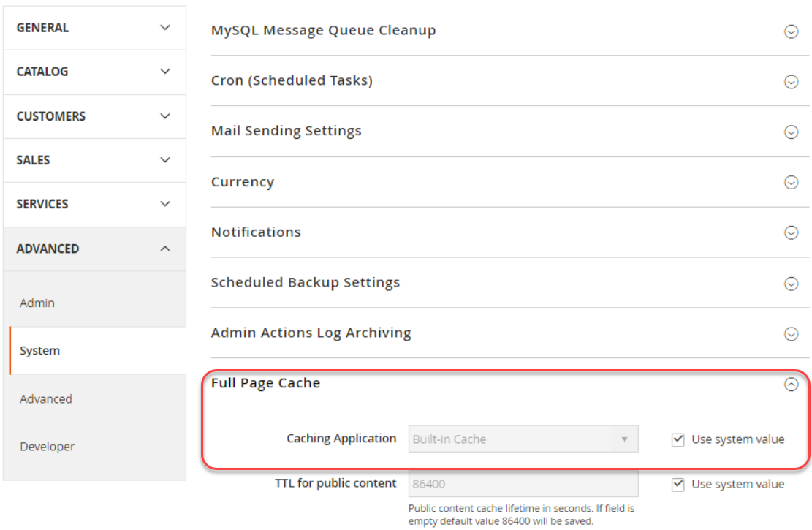

# Fastly Services konfigurieren

Für Adobe Commerce ist in Staging- und Produktionsumgebungen der Cloud-Infrastruktur eine schnelle Bereitstellung erforderlich.

Funktioniert schnell mit Varnish, um schnelle Zwischenspeicherungsfunktionen und ein [Content Delivery Network](https://glossary.magento.com/content-delivery-network) (CDN) für statische Assets bereitzustellen. Schnell stellt auch eine Web Application Firewall (WAF) bereit, um Ihre Site und Cloud-Infrastruktur zu schützen. Um Ihre Site und die Cloud-Infrastruktur vor bösartigem Traffic und Angriffen zu schützen, leiten Sie den gesamten eingehenden Site-Traffic schnell weiter.

>[!NOTE]
>
>Fastly ist nicht in Integrationsumgebungen verfügbar.

Führen Sie die folgenden Schritte aus, um Fastly zu einem frühen Zeitpunkt in Ihrem Site-Entwicklungsprozess zu aktivieren, zu konfigurieren und zu testen, um einen sicheren Zugriff auf Ihre Site zu ermöglichen.

- Schnelles Abrufen von Anmeldeinformationen für Staging- und Produktionsumgebungen
- Fastly-CDN-Zwischenspeicherung aktivieren
- Fastly VCL-Snippets hochladen
- DNS-Konfiguration aktualisieren, um Traffic zum Fastly-Dienst zu leiten
- Schnelles Zwischenspeichern testen

>[!NOTE]
>
>Nachdem Sie die anfängliche Fastly-Konfiguration aktiviert und überprüft haben, können Sie die Konfiguration anpassen. Sie können beispielsweise zusätzliche Optionen wie Bildoptimierung, Edge-Module und benutzerdefinierten VCL-Code aktivieren. Siehe [Cache-Konfiguration anpassen](fastly-custom-cache-configuration.md).

## Schnelles Abrufen von Anmeldedaten

Während der Projektbereitstellung fügt Adobe Ihr Projekt zum [Fastly-Dienstkonto](fastly.md#fastly-service-account-and-credentials) für Adobe Commerce in der Cloud-Infrastruktur hinzu und erstellt Fastly-Kontoanmeldeinformationen für die Starter `master` - und Pro Staging- und Produktionsumgebungen. Jede Umgebung verfügt über eindeutige Anmeldeinformationen.

Sie benötigen die Fastly-Anmeldeinformationen, um Fastly CDN-Dienste vom Admin zu konfigurieren und schnelle API-Anfragen zu senden.

>[!NOTE]
>
>Mit Adobe Commerce in der Cloud-Infrastruktur können Sie nicht direkt auf den Schnelladministrator zugreifen. Verwenden Sie den Administrator , um die Schnelle Konfiguration für Ihre Umgebungen zu überprüfen und zu aktualisieren. Wenn Sie ein Problem nicht mithilfe der Schnellfunktionen in Admin lösen können, senden Sie ein [Adobe Commerce-Supportticket](https://experienceleague.adobe.com/docs/commerce-knowledge-base/kb/help-center-guide/magento-help-center-user-guide.html#submit-ticket).

Verwenden Sie die folgenden Methoden, um die Fastly-Dienst-ID und das API-Token für Ihre Umgebung zu finden und zu speichern:

**So zeigen Sie Ihre Fastly-Anmeldedaten an**:

Die Methode zum Anzeigen von Anmeldedaten unterscheidet sich bei Pro- und Starter-Projekten.

- Von IaaS bereitgestellter freigegebener Ordner: Verwenden Sie in Pro-Projekten SSH, um eine Verbindung zu Ihrem Server herzustellen und die Fastly-Anmeldeinformationen aus der Datei `/mnt/shared/fastly_tokens.txt` zu erhalten. Staging- und Produktionsumgebungen verfügen über eindeutige Anmeldeinformationen. Sie müssen die Anmeldeinformationen für jede Umgebung abrufen.

- Lokaler Arbeitsbereich: Verwenden Sie in der Befehlszeile die CLI `magento-cloud` für die Listeneingabe und die Überprüfung der Umgebungsvariablen [ Fastly .](../environment/variables-cloud.md#viewing-environment-variables)

  ```bash
  magento-cloud variable:get -e <environment-ID>
  ```

- [!DNL Cloud Console] - Überprüfen Sie die folgenden Umgebungsvariablen in der [Umgebungskonfiguration](../project/overview.md#configure-environment).

   - `CONFIG__DEFAULT__SYSTEM__FULL_PAGE_CACHE__FASTLY__FASTLY_API_KEY`

   - `CONFIG__DEFAULT__SYSTEM__FULL_PAGE_CACHE__FASTLY__FASTLY_SERVICE_ID`

>[!NOTE]
>
>Wenn Sie die Fastly-Anmeldeinformationen für die Staging- oder Produktionsumgebungen nicht finden können, wenden Sie sich an Ihren Adobe Customer Technical Advisor (CTA).

## Schnelles Zwischenspeichern aktivieren

Sie benötigen die folgenden Komponenten, um Fastly-Dienste zu aktivieren und zu konfigurieren:

- Neueste Version des [Fastly CDN for Magento 2 Module](fastly.md#fastly-cdn-module-for-magento-2), das in den Staging- und Produktionsumgebungen installiert ist. Siehe [Schnelles Upgrade](#upgrade-the-fastly-module).

- [Schnelle Anmeldeinformationen](#get-fastly-credentials) für Adobe Commerce in Staging- und Produktionsumgebungen der Cloud-Infrastruktur

**So aktivieren Sie die schnelle CDN-Zwischenspeicherung in Staging und Produktion**:

{{admin-login-step}}

1. Klicken Sie auf &quot;**Stores**&quot;> &quot;Einstellungen&quot;> &quot;**Konfiguration**&quot;> &quot;**Erweitert**&quot;> &quot;**System**&quot;und erweitern Sie &quot;**Vollständiger Seiten-Cache**&quot;.

   

1. Entfernen Sie im Abschnitt _Caching Application_ die Auswahl aus **Use system value** und wählen Sie dann **Fastly CDN** aus der Dropdownliste aus.

   

1. Erweitern Sie **Fastly Configuration** und [wählen Sie die Caching-Optionen](https://github.com/fastly/fastly-magento2/blob/master/Documentation/CONFIGURATION.md#configure-the-module) aus.

1. Klicken Sie nach dem Konfigurieren der Zwischenspeicheroptionen oben auf der Seite auf **Konfiguration speichern** .

1. Löschen Sie den Cache gemäß der Benachrichtigung.

1. Fahren Sie mit der schnellen Konfiguration fort, indem Sie zurück zu **Stores** > **Einstellungen** > **Konfiguration** > **Erweitert** > **System** > **Schnelle Konfiguration** navigieren.

### Schnelles Testen von Anmeldeinformationen

1. Navigieren Sie auf dem Admin zu &quot;**Stores**&quot;> &quot;Einstellungen&quot;> &quot;**Konfiguration**&quot;> &quot;**Erweitert**&quot;> &quot;**System**&quot;> &quot;**Schnelle Konfiguration**&quot;.

1. Fügen Sie bei Bedarf die Werte **Fastly service ID** und **API token** für Ihre Projektumgebung hinzu.

   

   >[!NOTE]
   >
   >Wählen Sie den Link nicht aus, um das Fastly API-Token zu erstellen. Verwenden Sie stattdessen die von Adobe bereitgestellten [Fastly-Anmeldeinformationen (Dienst-ID und API-Token) von Adobe](#get-fastly-credentials).

1. Klicken Sie auf **Testberechtigungen**.

1. Wenn der Test erfolgreich ist, klicken Sie auf **Konfiguration speichern** und löschen Sie dann den Cache.

   Wenn der Test fehlschlägt, überprüfen Sie, ob die richtigen Dienst-ID- und API-Token-Werte mit den Anmeldeinformationen für die aktuelle Umgebung übereinstimmen.

   Wenn der Test erneut fehlschlägt, senden Sie ein Adobe Commerce-Supportticket oder kontaktieren Sie Ihren Adobe-Kundenbetreuer. Schließen Sie bei Pro-Projekten die URLs für Ihre Produktions- und Staging-Sites ein. Schließen Sie bei Einstiegsprojekten die URLs für Ihre `Master` - und Staging-Site ein.

>[!NOTE]
>
>Anweisungen zum Ändern der Fastly-API-Token-Anmeldeinformationen für eine Staging- oder Produktionsumgebung finden Sie unter [Fastly-Anmeldeinformationen ändern](fastly.md#change-fastly-api-token).

### VCL schnell hochladen

Laden Sie nach der Aktivierung des Fastly-Moduls den standardmäßigen [VCL-Code](https://github.com/fastly/fastly-magento2/tree/master/etc/vcl_snippets) auf die Fastly-Server hoch. Dieser Code bietet eine Reihe von VCL-Snippets, die die Konfigurationseinstellungen zum Aktivieren der Zwischenspeicherung und anderer Fastly CDN-Dienste für Ihre Adobe Commerce in der Cloud-Infrastruktur festlegen.

>[!NOTE]
>
>Fastly-Caching-Dienste funktionieren erst, wenn Sie den ersten Upload des Fastly VCL-Codes auf die Adobe Commerce-Staging- und -Produktions-Sites abgeschlossen haben.

**So laden Sie die schnelle VCL** hoch:

1. Klicken Sie im Abschnitt _Schnelle Konfiguration_ auf **VCL auf Fastly hochladen** , wie in der folgenden Abbildung dargestellt.

   

1. Nach Abschluss des Uploads aktualisieren Sie den Cache gemäß der Benachrichtigung oben auf der Seite.

## Bereitstellen von SSL-/TLS-Zertifikaten

Adobe stellt ein domänenvalidiertes SSL-/TLS-Zertifikat zur Verfügung, das den sicheren HTTPS-Traffic von Fastly aus verschlüsselt. Adobe stellt für jede Pro Production-, Staging- und Starter Production-Umgebung ein Zertifikat bereit, um alle Domänen in dieser Umgebung zu schützen. Ausführliche Informationen zum bereitgestellten Zertifikat finden Sie unter [Adobe SSL (TLS)-Zertifikate für Adobe Commerce in der Cloud-Infrastruktur](https://experienceleague.adobe.com/docs/commerce-knowledge-base/kb/how-to/ssl-tls-certificates-for-magento-commerce-cloud-faq.html).

>[!NOTE]
>
>Sie können Ihr eigenes TLS- oder SSL-Zertifikat bereitstellen, anstatt das von Adobe bereitgestellte Zertifikat &quot;Let&#39;s Encrypt&quot;zu verwenden. Dieser Prozess erfordert jedoch zusätzliche Arbeit für die Einrichtung und Wartung. Um diese Option zu wählen, senden Sie ein Adobe Commerce-Supportticket oder arbeiten Sie mit Adobe zusammen, um Ihrer Adobe Commerce benutzerdefinierte gehostete Zertifikate in Cloud-Infrastrukturumgebungen hinzuzufügen.

Um die SSL-/TLS-Zertifikate für Adobe Commerce-Umgebungen zu aktivieren, führt die Adobe-Automatisierung die folgenden Schritte aus:

- Überprüfen des Domänenbesitzes
- Stellt ein SSL-/TLS-Zertifikat bereit, das bestimmte Top-Level- und Subdomains für Ihre Stores abdeckt.
- Lädt das Zertifikat in die Cloud-Umgebung hoch, wenn die Site live ist

Für diese Automatisierung müssen Sie die DNS-Konfiguration für Ihre Site aktualisieren, um Informationen zur Domänenvalidierung bereitzustellen. Verwenden Sie **one** der folgenden Methoden:

- **DNS-Validierung** - Aktualisieren Sie Ihre DNS-Konfiguration für Live-Sites mit CNAME-Einträgen, die auf den Fastly-Service verweisen.
- **ACME-Herausforderung CNAME-Einträge** - Aktualisieren Sie Ihre DNS-Konfiguration mit ACME-Challenge-CNAME-Einträgen, die von Adobe für jede Domäne in Ihrer Umgebung bereitgestellt werden

>[!TIP]
>
>Wenn Sie eine Produktionsdomäne haben, die nicht aktiv ist, verwenden Sie die CNAME-Einträge für die ACME-Anfrage zur Domänenvalidierung. Durch frühzeitiges Hinzufügen der Einträge zur DNS-Konfiguration kann Adobe das SSL-/TLS-Zertifikat mit den richtigen Domänen bereitstellen, bevor die Site gestartet wird. Bevor Sie mit der Produktion beginnen, müssen Sie diese Platzhalterdatensätze durch die von Adobe bereitgestellten CNAME-Einträge ersetzen.

Wenn die Domänenvalidierung abgeschlossen ist, stellt Adobe das TLS/SSL-Zertifikat verschlüsseln bereit und lädt es in die Live-Staging- oder Produktionsumgebungen hoch. Dieser Vorgang kann bis zu 12 Stunden dauern. Es wird empfohlen, die DNS-Konfigurationsaktualisierungen einige Tage im Voraus durchzuführen, um Verzögerungen bei der Site-Entwicklung und beim Website-Start zu vermeiden.

## DNS-Konfiguration mit Entwicklungsparametern aktualisieren

Während des anfänglichen Einrichtungsprozesses können Sie die folgenden URLs verwenden, um die schnelle Zwischenspeicherung in Staging- und Produktionsumgebungen zu konfigurieren und zu testen:

- Für Pro Staging und Produktion:

   - `mcprod.<your-domain>.com`
   - `mcstaging.<your-domain>.com`

- Nur für Starterproduktion:

   - `mcprod.<your-domain>.com`

Diese standardmäßigen Pre-Production-URLs sind verfügbar, nachdem Ihr Projekt bereitgestellt wurde. Der Wert für `"your-domain"` ist der Domänenname, den Sie beim Onboarding-Prozess angegeben haben.

>[!NOTE]
>
>Sie können in Starter-Projekten keine benutzerdefinierte Domäne für eine Nicht-Produktionsumgebung angeben.

Um Traffic von Ihren Store-URLs an den Fastly-Dienst zu leiten, aktualisieren Sie Ihre DNS-Konfiguration. Wenn Sie die Konfiguration aktualisieren, stellt Adobe automatisch die erforderlichen SSL-/TLS-Zertifikate bereit und lädt sie in Ihre Cloud-Umgebungen hoch. Diese Bereitstellung kann bis zu 12 Stunden dauern.

>[!NOTE]
>
>Wenn Sie bereit sind, Ihre Produktions-Site zu starten, müssen Sie die DNS-Konfiguration erneut aktualisieren, um Ihre Produktionsdomänen auf den Fastly-Dienst zu verweisen und zusätzliche Konfigurationsaufgaben durchzuführen. Siehe [Checkliste starten](../launch/checklist.md).

**Voraussetzungen:**

- Aktivieren Sie das Fastly-Modul.
- Laden Sie den standardmäßigen Fastly VCL-Code hoch.
- Stellen Sie für jede Umgebung eine Liste mit Top-Level- und Subdomains zur Adobe bereit oder senden Sie ein Adobe Commerce Support-Ticket.
- Warten Sie auf die Bestätigung, dass die angegebenen Domänen zu Ihren Cloud-Umgebungen hinzugefügt wurden.
- Fügen Sie bei Starter-Projekten die Domänen Ihrer Fastly-Service-Konfiguration hinzu. Siehe [Domänen verwalten](fastly-custom-cache-configuration.md#manage-domains).
- Informationen zum Aktualisieren der DNS-Konfiguration erhalten Sie, wenn Sie bei Ihrem [DNS-Registrar](https://lookup.icann.org/) nach der richtigen Methode für Ihren Domain-Dienst suchen.

**Aktualisieren Ihrer DNS-Konfiguration für die Entwicklung**:

1. Zeigen Sie die Pre-Production-URLs an den Fastly-Dienst, indem Sie CNAME-Einträge hinzufügen: `prod.magentocloud.map.fastly.net`, z. B.:

   | Domäne oder Subdomäne | CNAME |
   |---------------------------|----------------------------------|
   | mcprod.your-domain.com | prod.magentocloud.map.fastly.net |
   | mcstaging.your-domain.com | prod.magentocloud.map.fastly.net |

   Wenn die CNAME-Einträge aktiv sind, stellt Adobe Zertifikate bereit und lädt die SSL-/TLS-Zertifikate hoch.

   >[!NOTE]
   >
   >Wenn Sie für Ihre Produktions-Site Apex-Domänen (`your-domain.com`) verwenden möchten, müssen Sie DNS-Adressdatensätze (A-Einträge) so konfigurieren, dass sie auf die Fastly-Server-IP-Adressen verweisen. Siehe [Aktualisieren der DNS-Konfiguration mit Produktionseinstellungen](../launch/checklist.md#to-update-dns-configuration-for-site-launch).


1. Fügen Sie ACME-Challenge-CNAME-Einträge für die Domänenvalidierung und Vorbereitstellung von SSL-/TLS-Produktionszertifikaten hinzu, z. B.:

   | Domäne oder Subdomäne | CNAME |
   |-------------------------------------------|-------------------------------------------|
   | _acme-challenge.your-domain.com | 0123456789abcdef.validation.magento.cloud |
   | _acme-challenge.www.your-domain.com | 9573186429stuvwx.validation.magento.com |
   | _acme-challenge.mystore.your-domain.com | 1234567898zxywvu.validation.magento.cloud |
   | _acme-challenge.subdomain.your-domain.com | 1098765743lmnopq.validation.magento.cloud |

   >[!NOTE]
   >
   >Die ACME-Anforderungsdatensätze in diesem Beispiel sind Platzhalter, die nicht zur Bereitstellung Ihrer Adobe Commerce-Staging- und -Produktionsstandorte vorgesehen sind. Erhalten Sie die richtigen ACME-Provokations-Datensatzinformationen für Ihr Projekt, indem Sie sich an Adobe wenden.

   Nachdem Sie die CNAME-Einträge hinzugefügt haben, validiert Adobe die Domänen und stellt das SSL-/TLS-Zertifikat für die Umgebung bereit. Wenn Sie die DNS-Konfiguration aktualisieren, um den Traffic von diesen Domänen zum Fastly-Dienst zu leiten, lädt Adobe das Zertifikat in die Umgebung hoch.

1. Aktualisieren Sie die Adobe Commerce-Basis-URL.

   - Verwenden Sie SSH, um sich bei der Produktionsumgebung anzumelden.

     ```bash
     magento-cloud ssh
     ```

   - Verwenden Sie die Cloud-CLI, um die Basis-URL für Ihren Store zu ändern.

     ```bash
     php bin/magento setup:store-config:set --base-url="https://mcstaging.your-domain.com/"
     ```

   >[!NOTE]
   >
   >Alternativ zur Verwendung der Cloud-CLI können Sie die Basis-URL über [Admin](https://experienceleague.adobe.com/docs/commerce-admin/stores-sales/site-store/store-urls.html) aktualisieren

1. Starten Sie den Webbrowser neu.

1. Testen Sie Ihre Website.

## Schnelles Zwischenspeichern testen

Nachdem Sie die DNS-Konfigurationsänderungen abgeschlossen haben, überprüfen Sie mit dem Befehlszeilenwerkzeug [cURL](https://curl.se/) , ob der Fastly-Cache funktioniert.

**Überprüfen der Antwortheader**:

1. Verwenden Sie in einem Terminal den folgenden `curl`-Befehl, um Ihre Live-Site-URL zu testen:

   ```bash
   curl -vo /dev/null -H Fastly-Debug:1 https://<live-URL>
   ```

   Wenn Sie keine statische Route festgelegt oder die DNS-Konfiguration für die Domänen auf Ihrer Live-Site abgeschlossen haben, verwenden Sie das `--resolve` -Flag, das die DNS-Namensauflösung umgeht.

   ```bash
   curl -vo /dev/null -H Fastly-Debug:1 --resolve <live-URL-hostname>:443:<live-IP-address>
   ```

1. Überprüfen Sie in der Antwort die [Kopfzeilen](fastly-troubleshooting.md#check-cache-hit-and-miss-response-headers) , um sicherzustellen, dass Fastly funktioniert. Folgende eindeutige Header sollten in der Antwort angezeigt werden:

   ```http
   < Fastly-Magento-VCL-Uploaded: yes
   < X-Cache: HIT, MISS
   ```

Wenn die Header nicht über die richtigen Werte verfügen, finden Sie Hilfe zur Fehlerbehebung unter [Beheben von Fehlern in den Antwortheadern](fastly-troubleshooting.md#curl).

## Upgrade des Fastly-Moduls

Aktualisiert das Fastly CDN für Magento 2-Modul schnell, um Probleme zu beheben, die Leistung zu steigern und neue Funktionen bereitzustellen.
Wir empfehlen, das Fastly-Modul in Ihren Staging- und Produktionsumgebungen auf die [neueste Version](https://github.com/fastly/fastly-magento2/blob/master/VERSION) zu aktualisieren.

Nach der Aktualisierung des Moduls müssen Sie den VCL-Code hochladen, um die Änderungen auf die Fastly-Dienstkonfiguration anzuwenden.

>[!WARNING]
>
> Wenn Sie den standardmäßigen Fastly VCL-Code mit einer benutzerdefinierten Version angepasst haben, überschreibt das Upgrade des Fastly-Moduls Ihre Änderungen. Wenn Sie benutzerdefinierte VCL-Snippets mit eindeutigen Namen hinzugefügt haben, werden diese Änderungen während des Aktualisierungsprozesses beibehalten. Es empfiehlt sich, die Staging-Umgebung zu aktualisieren und die Änderungen zu validieren, bevor sie auf die Produktionsumgebung angewendet werden.

**Überprüfen der Version des Fastly CDN-Moduls auf Magento 2**:

1. Wechseln Sie zum Stammverzeichnis Ihrer Cloud-Umgebung.

1. Überprüfen Sie mithilfe von Composer die installierte Version.

   ```bash
   composer show *fastly*
   ```

1. Wenn die [neueste Version](https://github.com/fastly/fastly-magento2/releases) nicht installiert ist, führen Sie die Schritte zum Aktualisieren des Fastly-Moduls aus.

**Aktualisieren des Fastly-Moduls**:

1. Verwenden Sie in Ihrer lokalen Integrationsumgebung die folgenden Modulinformationen zum [Aktualisieren des Fastly-Moduls](../store/extensions.md#upgrade-an-extension).

   ```text
   module name: fastly/magento2
   repository: https://github.com/fastly/fastly-magento2.git
   ```

1. Senden Sie Ihre Aktualisierungen an die Staging-Umgebung.

1. Melden Sie sich bei Admin für Ihre Staging-Umgebung an und laden Sie [den VCL-Code hoch](#upload-vcl-to-fastly).

1. [Überprüfen Sie die Schnelldienste ](fastly-troubleshooting.md#verify-or-debug-fastly-services) auf der Adobe Commerce Staging-Site.

Nachdem Sie die Fastly-Dienste auf der Staging-Site überprüft haben, wiederholen Sie den Aktualisierungsprozess in der Produktionsumgebung.

>[!TIP]
>
> Wenn Sie Probleme mit Fastly-Diensten in Ihren Adobe Commerce-Umgebungen haben, lesen Sie den Abschnitt zur Fehlerbehebung bei [Adobe Commerce Fastly ](https://experienceleague.adobe.com/docs/commerce-knowledge-base/kb/troubleshooting/miscellaneous/magento-fastly-troubleshooter.html).
