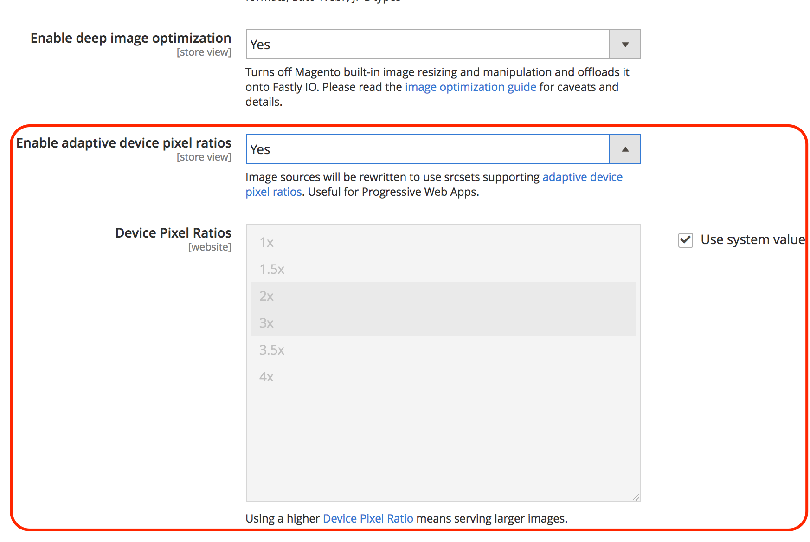

# Schnelle Bildoptimierung

Die schnelle Bildoptimierung (Fastly IO) bietet Echtzeit-Bildbearbeitung und -Optimierung, um die Bildbereitstellung zu beschleunigen und die Verwaltung von Bildquellensätzen für responsive Webanwendungen zu vereinfachen. Nach der Konfiguration bietet Fastly IO die folgenden Bildoptimierungsfunktionen:

- Erzwingen der verlustfreien Konvertierung
- Deep-Image-Optimierung
- Adaptive Pixelverhältnisse
- Unterstützung für gängige Bildformate: PNG, JPEG, GIF und WebP

Bevor Sie die Option Fastly IO aktivieren und konfigurieren, müssen Sie Ihren Fastly-Dienst einrichten und die Herkunftssicherung konfigurieren.

Basierend auf Ihren Konfigurationseinstellungen fügt das Snippet Fastly Image Optimization (Fastly IO) den VCL-Code ein, um die Bildoptimierung durchzuführen, die die Bereitstellung von Produktbildern in der Storefront beschleunigt. Es gibt drei Schritte zum Konfigurieren der Fastly IO: Aktivieren, Konfigurieren und Überprüfen.

## Fastly IO aktivieren

Aktivieren Sie die Fastly Image Optization (Fastly IO) über das Admin-Bedienfeld, indem Sie das Fastly IO VCL-Snippet hochladen. Das Snippet enthält die Schnellkonfigurationsanweisungen zur Verarbeitung aller Bilder über Bildoptimierer unter Verwendung von Standardkonfigurationen.

**Voraussetzungen:**

- Installieren Sie das Fastly-Modul Version 1.2.62 oder höher oder aktualisieren Sie es
- [Fastly Origin-Schutzschild und Back-End konfigurieren](fastly-custom-cache-configuration.md#configure-back-ends-and-origin-shielding)

**So aktivieren Sie Fastly IO**:

1. Melden Sie sich bei Ihrem lokalen Bedienfeld [Admin](../../get-started/onboarding.md#access-your-admin-panel) als Administrator an.

1. Wählen Sie **Stores** > **Einstellungen** > **Konfiguration** > **Erweitert** > **System**.

1. Erweitern Sie im rechten Bereich den Eintrag **Vollständiger Seiten-Cache**.

1. Wählen Sie **Fastly Configuration** > **Image Optimization** aus, um die Konfigurationseinstellungen anzugeben.

1. Wählen Sie im Feld _Fastly IO snippet_ die Option **Enable/Disable** aus.

1. Laden Sie das Fastly IO-Snippet hoch:

   - Wählen Sie **Standard-I/O-Konfigurationsoptionen** aus, um die Seite mit den standardmäßigen Konfigurationsoptionen für die Bildoptimierung zu öffnen.
   - Wählen Sie **Hochladen** aus, um das VCL-Snippet auf Ihren Server hochzuladen.

## Fastly IO konfigurieren

Überprüfen und aktualisieren Sie bei Bedarf die standardmäßigen IO-Konfigurationseinstellungen für die Bildoptimierung. Sie können beispielsweise die WebP- und JPEG-Qualitätsstufen für verlustbehaftete Formate ändern oder das Format für die Bereitstellung von JPEG-Bildern in _progressiv_ oder _Baseline_ ändern. Außerdem können Sie Fastly IO für detailliertere Bildoptimierungsfunktionen verwenden, z. B.:

- Erzwingen der verlustfreien Konvertierung
- Deep-Image-Optimierung
- Adaptive Pixelverhältnisse

**So aktualisieren Sie schnell IO**:

1. Wählen Sie auf der Seite _Schnelle Konfiguration_ im Feld _Standard-I/O-Konfigurationsoptionen_ die Option **Konfigurieren**.

   

1. Überprüfen und aktualisieren Sie die Einstellungen der Fastly IO-Konfiguration auf der Seite _Standardkonfigurationsoptionen für die Bildoptimierung_:

   

   - **Auto WebP?** - Behalten Sie die Standardeinstellung (`Yes`) bei, um Bilder in Browsern, die sie unterstützen, in das WebP-Format zu konvertieren. Wenn Sie die Einstellung auf **Nein** ändern, verwendet Fastly den Bilddateityp, anstatt das Bild in das WebP-Format zu konvertieren.

   - **WebP-Standardqualität (verlustbehaftet)** - Behalten Sie die Standardeinstellung (`85`) bei oder geben Sie die Komprimierungsstufe für verlustbehaftete dateiformatierte Bilder ein. Sie können eine beliebige Ganzzahl von 1 bis 100 angeben.

   - **Standardmäßige Steuerelemente im JPEG-Format** - Behalten Sie die Standardeinstellung (`Auto`) bei oder wählen Sie den JPEG-Typ aus, der für die Bildbereitstellung verwendet werden soll. Wenn der Wert auf _Auto_ festgelegt ist, stellt Fastly Bilder mit dem Ausgabetyp bereit, der dem Eingabetyp entspricht. Wählen Sie _Grundlinie_ aus, um Bilder in Zeilen von oben links nach unten anzuzeigen. Wählen Sie _Progressiv_ aus, um ein unscharfes Bild anzuzeigen, das beim Laden gelöscht wird.

   - **Standardqualität der JPEG** - Behalten Sie die Standardeinstellung (`85`) bei oder geben Sie die Komprimierungsstufe für verlustbehaftete Dateiformate ein. Geben Sie eine beliebige Ganzzahl von 1 bis 100 an.

   - **Vergrößern zulassen?**: Behalten Sie die Standardeinstellung (`No`) bei oder wählen Sie `Yes` aus, um Bilder zurückzugeben, die größer als die Originalquelldatei sind, damit sie in die angeforderten Dimensionen passen.

   - **Filter vergrößern** - Behalten Sie die Standardeinstellung (`Lancsoz3`) bei oder wählen Sie eine Alternative aus. Diese Einstellung gibt den Filter an, der zum Bereitstellen eines in der Größe angepassten Bildes verwendet wird. Je nach ausgewähltem Filter kann das in der Größe angepasste Bild eine höhere oder niedrigere Anzahl Pixel aufweisen.

      - `Lanczos3` (Standard): Stellt das Bild mit der besten Qualität bereit. Es erhöht die Fähigkeit, Kanten und lineare Funktionen innerhalb eines Bildes zu erkennen, und verwendet die Neuberechnung von _[!DNL sinc]_, um die bestmögliche Rekonstruktion zu ermöglichen.
      - `Lanczos2`—Verwendet denselben Filter wie `Lancsoz3`, jedoch mit einer weniger genauen Annäherung an die _[!DNL sinc]_Resampling-Funktion.
      - `Bicubic`: Hat einen natürlichen Scharfzeichnungseffekt, wenn ein Bild kleiner gemacht wird.
      - `Bilinear`: Hat einen natürlichen Ausgleichungseffekt, wenn ein Bild größer wird.
      - `Nearest`: Hat einen natürlichen Pixeleffekt bei der Größenanpassung der Pixelgrafik.

1. Nachdem Sie die IO-Konfigurationseinstellungen für den Fastly-Dienst festgelegt haben, wählen Sie **Abbrechen** aus, um zu den Einstellungen für die schnelle Konfiguration zurückzukehren.

1. Wählen Sie im Feld Bildoptimierungskonfiguration _Deep-Bild-Optimierung aktivieren_ die Option **Ja** aus, um die Deep-Image-Optimierung zu aktivieren.

   

   Die Deep-Image-Optimierung ist standardmäßig deaktiviert. Wenn diese Funktion aktiviert ist, ist die integrierte Größenanpassungsfunktion in Adobe Commerce deaktiviert und die Größenanpassung wird an den Fastly IO-Dienst abgeladen. Die Bildoptimierung gilt nur für Produktbilder. Die Größe von CMS-Bildern wird nicht geändert. Weitere Informationen finden Sie in der [Fastly-Dokumentation](#deep-image-optimization).

1. Nachdem Sie die Deep-Image-Optimierung aktiviert haben, aktivieren Sie die Funktion [Adaptive Pixelverhältnisse](#adaptive-pixel-ratios) , um Bilder zu generieren, die für die Verwendung auf responsiven Websites optimiert sind.

   

   - Wählen Sie im Feld _Pixelverhältnisse des adaptiven Geräts aktivieren_ die Option **Ja** aus.
   - Akzeptieren Sie im Feld _Gerätepixelverhältnisse_ die Standardeinstellung oder aktivieren Sie das Kontrollkästchen **Systemeingabe** , um die Einstellung zu entfernen. Wählen Sie dann das gewünschte Verhältnis aus. Eine höhere Einstellung für das Gerätepixelverhältnis liefert größere Bilder.

1. Wählen Sie **Konfiguration speichern** aus.

### Erzwingen der verlustfreien Konvertierung

Standardmäßig erzwingt der Fastly IO-Dienst die Konvertierung verlustfreier Formate wie PNG, BMP oder WEBP in das JPEG/WEBP-Format.

Der Vorteil der erzwungenen verlustbehafteten Konvertierung besteht darin, dass kleinere Bilder bereitgestellt werden.
Wenn Sie beispielsweise das JPEG- oder WEBp-Format anstelle von PNG verwenden, kann die Größe je nach der in der Fastly IO-Konfiguration angegebenen Qualitätsstufe um 60 bis 70 Prozent reduziert werden.

Je nach der für die Bildoptimierung ausgewählten Qualitätsstufe können visuelle Unterschiede bei Bildern auftreten. Beispielsweise werden Alpha-Kanäle/Transparenzen entfernt und durch einen weißen Hintergrund ersetzt, es sei denn, Sie verwenden eine Deep-Image-Optimierung, die die Hintergrundfarbe Ihres Designs verwendet.

Wenn Sie die verlustreiche Konvertierung (`WebP Auto? = No`) deaktivieren, ändert Fastly IO nur JPEG-Bilder für kompatible Browser in das WEBP-Format. Es werden keine anderen Bildtypen geändert. Wenn das Originalbild beispielsweise PNG ist, lautet die Ausgabe vom Fastly IO-Dienst PNG.

### Deep-Image-Optimierung

Die Deep-Image-Optimierung ist standardmäßig deaktiviert. Durch Aktivierung dieser Option wird die integrierte Adobe Commerce-Größenanpassung deaktiviert und vollständig an den Fastly IO-Dienst abgeladen.
Diese Funktion ändert nur die Größe von _Produkt_-Bildern. Die Größe von CMS-Bildern wird nicht geändert.

Durch die Aktivierung der Deep-Image-Optimierung wird jedem Bild eine Hintergrundfarbdefinition hinzugefügt, wie in Ihrem Design definiert. Daher werden WebP-Bilder verlustfrei von WebP in verlustfreies WebP umgestellt. Einer der Hauptunterschiede zwischen verlustfrei und verlustfrei besteht darin, dass der Alphakanal verlustfrei von PNG-Bildern entfernt wird, wodurch wesentlich kleinere Bilder bereitgestellt werden. Bilder mit Transparenz können jedoch auf Produkt- und Kampagnenseiten mit einem anderen Hintergrund merkwürdig aussehen.

Beispielsweise stellt der folgende Code die ursprüngliche Quelle für ein Bild aus dem Luma-Design dar:

```html

```

Wenn die Funktion Fastly IO Deep-Bild-Optimierung aktiviert ist, wird der ursprüngliche Quellcode für das Bild wie im folgenden Beispiel gezeigt umgeschrieben:

```html

```

### Adaptive Pixelverhältnisse

Die Funktion Adaptive Pixelverhältnisse ist nützlich, um Bilder für progressive Webanwendungen zu optimieren. Dadurch können Sie mehrere Bildgrößen und Auflösungen aus einer Bildquellendatei bereitstellen, indem Sie für jedes Produktbild einen Wert von `srcset` hinzufügen.

Wenn die Funktion Adaptive Pixelverhältnisse aktiviert ist, stellt der Fastly IO-Dienst ein Bild mit fester Breite bereit, das sich an variierende `device-pixel-ratios` anpassen kann.
Beispielsweise ändert der Dienst die Produktbilddefinition wie im folgenden Beispiel gezeigt:

```html

```

Siehe `srcset` [Browserunterstützung](https://caniuse.com/#feat=srcset) und [Spezifikation](https://html.spec.whatwg.org/multipage/embedded-content.html#attr-img-srcset).

## Fastly IO überprüfen

Nachdem Sie Fastly IO aktiviert und konfiguriert haben, validieren Sie Ihre Konfiguration, indem Sie Webseitenschnelltests mit und ohne Fastly IO-Aktivierung durchführen. Überprüfen Sie außerdem die Bilder in Ihrem Store, um die Bildgröße und das Erscheinungsbild auf Probleme zu überprüfen.
