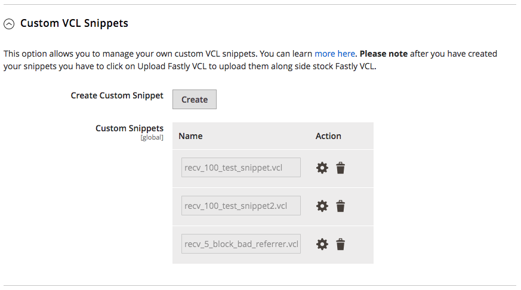

# Erste Schritte mit benutzerdefiniertem VCL

Fastly unterstützt eine angepasste Version der Varnish Configuration Language (VCL), um die Fastly-Service-Konfiguration auf Ihre Anforderungen anzupassen.

Benutzerdefinierte VCL-Snippets sind Blöcke der VCL-Logik, die zur aktiven VCL-Version hinzugefügt wird, die auf Ihre Adobe Commerce-Site hochgeladen wurde. Ein benutzerdefiniertes VCL-Snippet ändert, wie schnelle Zwischenspeicherdienste auf Anforderungs-Traffic reagieren. Sie können beispielsweise ein benutzerdefiniertes VCL-Snippet hinzufügen, um den Anforderungs-Traffic nur von bestimmten Client-IP-Adressen zuzulassen. Alternativ können Sie ein Snippet erstellen, um Traffic von Websites zu blockieren, von denen bekannt ist, dass sie VerweisspAM an Ihre Adobe Commerce-Sites senden.

Benutzerdefinierte VCL-Snippets - generiert, kompiliert und an alle Fastly-Caches übertragen - laden und aktivieren Sie ohne Serverausfall.

>[!NOTE]
>
>Bevor Sie Ihrer Fastly-Modulkonfiguration benutzerdefinierten VCL-Code, Edge-Wörterbücher und ACLs hinzufügen, überprüfen Sie, ob der Fastly-Caching-Dienst mit der Standardkonfiguration funktioniert. Siehe [Fastly Services konfigurieren](fastly-configuration.md).

Unterstützt schnell zwei Arten von benutzerdefinierten VCL-Snippets:

- [Reguläre Snippets](https://docs.fastly.com/en/guides/about-vcl-snippets)—Benutzerdefinierte reguläre VCL-Snippets werden für bestimmte VCL-Versionen codiert. Sie können reguläre VCL-Snippets über die Admin- oder die Fastly-API erstellen, ändern und bereitstellen.

- [Dynamische Snippets](https://docs.fastly.com/en/guides/using-dynamic-vcl-snippets)—VCL-Snippets, die mit der Fastly-API erstellt wurden. Sie können dynamische Snippets ändern und bereitstellen, ohne die Fastly VCL-Version für Ihren Dienst aktualisieren zu müssen.

Es wird empfohlen, benutzerdefinierte VCL-Snippets mit Edge-Wörterbüchern und Zugriffssteuerungslisten (ACL) zu verwenden, um Daten zu speichern, die in Ihrem benutzerdefinierten Code verwendet werden.

- [**Edge-Wörterbuch**](https://docs.fastly.com/guides/edge-dictionaries/about-edge-dictionaries)—Speichert Daten als Schlüssel-Wert-Paare in einem Wörterbuchcontainer, auf den von benutzerdefinierten VCL-Snippets verwiesen werden kann

- [**Edge ACL**](https://docs.fastly.com/guides/access-control-lists/about-acls)—Speichert die Client-IP-Adressdaten, die die Zugriffssteuerungsliste für Block- oder Zulassungsregeln definieren, die mit benutzerdefinierten VCL-Snippets implementiert wurden

Das Wörterbuch und die ACL-Daten werden auf den Fastly Edge-Knoten bereitgestellt, auf die über Netzwerkregionen hinweg zugegriffen werden kann. Außerdem können die Daten dynamisch im Netzwerk aktualisiert werden, ohne dass Sie den VCL-Code für Ihre Staging- oder Produktionsumgebung neu bereitstellen müssen.

>[!NOTE]
>
>Sie können benutzerdefinierte VCL-Snippets nur in einer Staging- oder Produktionsumgebung hinzufügen, wenn Sie [konfigurierte Fastly Services](fastly-configuration.md) für diese Umgebung.

## Tutorial

In diesem Tutorial und diesen Beispielen wird die Verwendung regulärer benutzerdefinierter VCL-Snippets mit Edge-Wörterbüchern und Edge-ACLs zum Anpassen der Fastly-Dienstkonfiguration für Adobe Commerce veranschaulicht. Weitere Informationen finden Sie in der Fastly-Dokumentation:

- [Guide to Fastly VCL](https://docs.fastly.com/guides/vcl/guide-to-vcl)—Informationen über die Implementierung von Fastly Varnish, Fastly VCL-Erweiterungen und Ressourcen für weitere Informationen über Varnish und VCL.
- [Fastly VCL-Referenz](https://docs.fastly.com/guides/vcl/)—Detaillierte Programmierreferenz zur Entwicklung und Fehlerbehebung von Fastly Custom VCL und benutzerdefinierten VCL-Snippets.

Sie können benutzerdefinierte VCL-Snippets über den Adobe Commerce-Administrator oder mithilfe der Fastly-API erstellen und verwalten:

- [Adobe Commerce Admin](#manage-custom-vcl-from-admin)—Wir empfehlen die Verwendung von Adobe Commerce Admin zur Verwaltung benutzerdefinierter VCL-Snippets, da dieser den Prozess zur Validierung, zum Hochladen und zur Anwendung der VCL-Änderungen auf die Fastly-Dienstkonfiguration automatisiert. Außerdem können Sie die benutzerdefinierten VCL-Snippets, die der Fastly-Dienstkonfiguration hinzugefügt wurden, über den Admin anzeigen und bearbeiten.

- [Fastly-API](#manage-vcl-using-the-api)—Wenn Sie nicht auf den Admin zugreifen können, verwenden Sie die Fastly-API, um benutzerdefinierte VCL-Snippets zu verwalten. Verwenden Sie beispielsweise die API zur Fehlerbehebung bei der Konfiguration des Fastly-Dienstes, wenn die Site ausfällt, oder zum Hinzufügen eines benutzerdefinierten VCL-Snippets. Außerdem können einige Vorgänge nur mit der API durchgeführt werden. Beispielsweise müssen Sie die API verwenden, um eine ältere VCL-Version zu reaktivieren oder alle VCL-Snippets anzuzeigen, die in einer bestimmten VCL-Version enthalten sind. Siehe [API-Kurzreferenz für VCL-Snippets](#api-quick-reference-for-vcl-snippets).

### Beispiel-VCL-Codefragment

Das folgende Beispiel zeigt das benutzerdefinierte VCL-Snippet (JSON-Format), das den Traffic nach Client-IP-Adresse filtert:

```json
{
  "service_id": "FASTLY_SERVICE_ID",
  "version": "{Editable Version #}",
  "name": "apply_acl",
  "priority": "100",
  "dynamic": "1",
  "type": "hit",
  "content": "if ((client.ip ~ {ACLNAME}) && !req.http.Fastly-FF){ error 403; }"
}
```

>[!WARNING]
>
>In diesem Beispiel wird der VCL-Code als JSON-Payload formatiert, die in einer Datei gespeichert und in einer Fastly API-Anfrage gesendet werden kann. Um JSON-Validierungsfehler beim Senden des Snippets als JSON für eine API-Anfrage zu vermeiden, verwenden Sie einen umgekehrten Schrägstrich, um Sonderzeichen im Code zu maskieren. Siehe [Verwenden dynamischer VCL-Snippets](https://docs.fastly.com/vcl/vcl-snippets/) in der Fastly VCL Dokumentation. Wenn Sie das VCL-Snippet vom Admin senden, müssen Sie keine Sonderzeichen umgehen.

Die VCL-Logik im `content` -Feld führt die folgenden Aktionen aus:

- Überprüft die eingehende IP-Adresse, `client.ip` bei jeder Anforderung

- Blockiert alle Anfragen mit einer im *ACLNAME* Edge-ACL, Zurückgeben einer `403 Forbidden` error

Die folgende Tabelle enthält Details zu Schlüsseldaten für benutzerdefinierte VCL-Snippets. Eine ausführlichere Referenz finden Sie im Abschnitt [VCL-Snippets](https://docs.fastly.com/api/config#api-section-snippet) -Referenz in der Fastly-Dokumentation.

| Wert | Beschreibung |
|--------------|-------------------------------------------------------------------------------------------------------------------------------------------------------------------------------------------------------------------------------------------------------------------------------------------------------------------------------------------------------------------------------------------------------------------------------------------------------------------------------------------------------------------------------------------------------------------------------------------------------------------------------------------------------------------------------------------------------------------------|
| `API_KEY` | Der API-Schlüssel für den Zugriff auf Ihr Fastly-Konto. Siehe [Abrufen von Anmeldeinformationen](fastly-configuration.md). |
| `active` | Aktiver Status des Snippets oder der Version. Rückgabe `true` oder `false`. Wenn &quot;true&quot;, wird das Snippet oder die Version verwendet. Klonen Sie ein aktives Snippet mit seiner Versionsnummer. |
| `content` | Das auszuführende Codefragment von VCL. Fastly unterstützt nicht alle VCL Sprachfunktionen. Außerdem bietet Fastly Erweiterungen mit benutzerdefinierten Funktionen. Weitere Informationen zu unterstützten Funktionen finden Sie unter [Fastly VCL-Programmierreferenz](https://docs.fastly.com/vcl/reference/). |
| `dynamic` | Dynamischer Status eines Snippets. Rückgabe `false` für [reguläre Snippets](https://docs.fastly.com/en/guides/about-vcl-snippets) in der versionierten VCL für die Fastly-Dienstkonfiguration enthalten. Rückgabe `true` für [dynamisches Snippet](https://docs.fastly.com/vcl/vcl-snippets/using-dynamic-vcl-snippets/) die geändert und bereitgestellt werden können, ohne dass eine neue VCL-Version erforderlich ist. |
| `number` | VCL-Versionsnummer, in der das Snippet enthalten ist Schnelle Verwendung *Bearbeitbare Versionsnummer* in ihren Beispielwerten. Wenn Sie benutzerdefinierte Snippets aus der API hinzufügen, geben Sie die Versionsnummer in die API-Anfrage ein. Wenn Sie benutzerdefinierte VCL aus dem Admin hinzufügen, wird die Version für Sie bereitgestellt. |
| `priority` | Numerischer Wert aus `1` nach `100` , der angibt, wann der benutzerdefinierte VCL-Codeabschnitt ausgeführt wird. Snippets mit niedrigeren Prioritätswerten werden zuerst ausgeführt. Wenn nicht angegeben, wird die Variable `priority` -Wert standardmäßig auf `100`.<p>Jedes benutzerdefinierte VCL-Snippet mit dem Prioritätswert `5` wird sofort ausgeführt, was am besten für VCL-Code ist, der das Anforderungsrouting implementiert (Blockieren und Zulassungslisten und Umleitungen). Priorität `100` ist am besten zum Überschreiben des standardmäßigen VCL-Codefragments.<p>Alle [Standard-VCL-Snippets](fastly-configuration.md#upload-vcl-snippets) im Magento-Fastly-Modul enthalten sind. `priority=50`.<ul><li>Weisen Sie eine hohe Priorität zu wie `100` um benutzerdefinierten VCL-Code nach allen anderen VCL-Funktionen auszuführen und den VCL-Standardcode zu überschreiben.</li></ul> |
| `service_id` | Die Fastly Service-ID für eine bestimmte Staging- oder Produktionsumgebung. Diese ID wird zugewiesen, wenn Ihr Projekt zur Adobe Commerce in der Cloud-Infrastruktur hinzugefügt wird. [Schnelles Dienstkonto](fastly.md#fastly-service-account-and-credentials). |
| `type` | Gibt den Speicherort zum Einfügen des generierten Snippets an, z. B. `init` (obige Unterroutinen) und `recv` (innerhalb von Unterroutinen). Weitere Informationen finden Sie unter Schnellere [VCL-Snippets](https://docs.fastly.com/api/config#api-section-snippet) Referenz. |

## Benutzerdefinierte VCL von Admin verwalten

Sie können [benutzerdefinierte VCL-Snippets hinzufügen](https://github.com/fastly/fastly-magento2/blob/master/Documentation/Guides/CUSTOM-VCL-SNIPPETS.md) aus dem *Schnelle Konfiguration* > *Benutzerdefinierte VCL-Snippets* im Admin-Bereich.



Die *Benutzerdefinierte VCL-Snippets* -Ansicht zeigt nur Snippets an, die über den Administrator hinzugefügt wurden. Wenn Snippets mit der Fastly-API hinzugefügt werden, verwenden Sie die API zu [verwalten](#manage-vcl-using-the-api).

Die folgenden Beispiele zeigen, wie Sie benutzerdefinierte VCL-Snippets aus dem Admin erstellen und verwalten und Fastly Edge-Module und Edge-Wörterbücher verwenden:

- [Anforderungen an ein CMS-Backend umleiten](fastly-vcl-wordpress.md)
- [Blockverweis-Spam](fastly-vcl-badreferer.md)
- [Blockverweis-Spam](fastly-vcl-badreferer.md)
- [Benutzerspezifische VCL für IP-Zulassungslisten](fastly-vcl-allowlist.md)
- [Benutzerspezifische VCL für IP-Blockierungslisten](fastly-vcl-blocking.md)
- [Schnellen Cache umgehen](fastly-vcl-bypass-to-origin.md)

## Verwalten von VCL mithilfe der API

Im folgenden Beispiel erfahren Sie, wie Sie reguläre VCL-Snippet-Dateien erstellen und sie mithilfe der Fastly-API zu Ihrer Fastly-Service-Konfiguration hinzufügen. Sie können die Snippets über die *Terminal* Anwendung. Sie benötigen keine SSH-Verbindung in einer bestimmten Umgebung.

**Voraussetzungen:**

- Konfigurieren Sie Ihre Adobe Commerce in der Cloud-Infrastruktur-Umgebung für Fastly-Dienste. Siehe [Schnelles Einrichten](fastly-configuration.md).

- [Schnelles Abrufen von API-Anmeldeinformationen](fastly-configuration.md) , um Anfragen an die Fastly-API zu authentifizieren. Stellen Sie sicher, dass Sie die Anmeldeinformationen für die richtige Umgebung erhalten: Staging oder Produktion.

- Speichern Sie die Fastly-Dienst-Anmeldeinformationen als Bash-Umgebungsvariablen, die Sie in cURL-Befehlen verwenden können:

  ```bash
  export FASTLY_SERVICE_ID=<Service-ID>
  ```

  ```bash
  export FASTLY_API_TOKEN=<API-Token>
  ```

  Die exportierten Umgebungsvariablen sind nur in der aktuellen Bash-Sitzung verfügbar und gehen beim Schließen des Terminals verloren. Sie können Variablen neu definieren, indem Sie einen neuen Wert exportieren. So zeigen Sie die Liste der exportierten Variablen für Fastly an:

  ```bash
  export | grep FASTLY
  ```

## Hinzufügen von VCL-Snippets

In diesem Tutorial werden die grundlegenden Schritte zum Hinzufügen benutzerdefinierter Snippets mithilfe der Fastly-API beschrieben.

>[!NOTE]
>
>Informationen zum Verwalten benutzerdefinierter VCL-Snippets über den Adobe Commerce-Administrator finden Sie unter [Verwalten von VCL über den Adobe Commerce-Administrator](#manage-custom-vcl-from-admin).


**Voraussetzungen**

{{$include /help/_includes/vcl-snippet-prerequisites.md}}

### Schritt 1: Suchen Sie die aktive VCL-Version.

Verwenden der Fastly-API [get version](https://docs.fastly.com/api/config#version_dfde9093f4eb0aa2497bbfd1d9415987) -Vorgang zum Abrufen der aktiven VCL-Versionsnummer:

```bash
curl -H "Fastly-Key: $FASTLY_API_TOKEN" https://api.fastly.com/service/$FASTLY_SERVICE_ID/version/active
```

Beachten Sie in der JSON-Antwort die aktive VCL-Versionsnummer, die in der `number` beispielsweise `"number": 99`. Sie benötigen die Versionsnummer, wenn Sie den VCL zur Bearbeitung klonen.

```json
{
  "testing": false,
  "locked": true,
  "number": 99,
  "active": true,
  "service_id": "872zhjyxhto5SIRb3GAE0",
  "staging": false,
  "created_at": "2019-01-29T22:38:53Z",
  "deleted_at": null,
  "comment": "Magento Module uploaded VCL",
  "updated_at": "2019-01-29T22:39:06Z",
  "deployed": false
}
```

Speichern Sie die aktive Versionsnummer in einer Bash-Umgebungsvariablen für die Verwendung in nachfolgenden API-Anfragen:

```bash
export FASTLY_VERSION_ACTIVE=<Version>
```

### Schritt 2: Clone the active VCL version and all snippets

Bevor Sie benutzerdefinierte VCL-Snippets hinzufügen oder ändern können, müssen Sie eine Kopie der aktiven VCL-Version zur Bearbeitung erstellen. Verwenden der Fastly-API [clone](https://docs.fastly.com/api/config#version_7f4937d0663a27fbb765820d4c76c709) -Vorgang:

```bash
curl -H "Fastly-Key: $FASTLY_API_TOKEN" https://api.fastly.com/service/$FASTLY_SERVICE_ID/version/$FASTLY_VERSION_ACTIVE/clone -X PUT
```

In der JSON-Antwort wird die Versionsnummer inkrementiert und die *active* Schlüsselwert ist `false`. Sie können die neue, inaktive VCL-Version lokal ändern.

```json
{
  "testing": false,
  "locked": false,
  "number": 100,
  "active": false,
  "service_id": "vW2bLFWhhto5SIRb3GAE0",
  "staging": false,
  "created_at": "2019-01-29T22:38:53Z",
  "deleted_at": null,
  "comment": "Magento Module uploaded VCL",
  "updated_at": "2019-01-29T22:39:06Z",
  "deployed": false
}
```

Speichern Sie die neue Versionsnummer in einer Bash-Umgebungsvariablen zur Verwendung in nachfolgenden Befehlen:

```bash
export FASTLY_EDIT_VERSION=<Version>
```

### Schritt 3: Erstellen eines benutzerdefinierten VCL-Snippets

Erstellen und speichern Sie Ihren benutzerdefinierten VCL-Code in einer JSON-Datei mit folgendem Inhalt und Format:

```json
{
  "name": "<name>",
  "dynamic": "0",
  "type": "<type>",
  "priority": "100",
  "content": "<code all in one line>"
}
```

Die Werte umfassen:

- `name`—Name für das VCL-Snippet.

- `dynamic`—Gibt an, ob es sich um eine [reguläres Snippet](https://docs.fastly.com/en/guides/about-vcl-snippets) oder [dynamisches Snippet](https://docs.fastly.com/guides/vcl-snippets/using-dynamic-vcl-snippets).

- `type`—Gibt den Speicherort für das Einfügen des generierten Snippets an, z. B. `init` (obige Unterroutinen) und `recv` (innerhalb von Unterroutinen). Siehe [Fastly VCL Snippet-Objektwerte](https://docs.fastly.com/api/config#snippet) für Informationen zu diesen Werten.

- `priority`—Ein Wert aus `1` nach `100` bestimmt, wann der benutzerdefinierte VCL-Codeausschnitt ausgeführt wird. Benutzerdefinierte VCL-Snippets mit niedrigeren Werten werden zuerst ausgeführt.

  Der gesamte VCL-Standardcode des Fastly VCL-Moduls verfügt über eine `priority` von `50`. Wenn eine Aktion zuletzt ausgeführt werden soll oder der standardmäßige VCL-Code überschrieben werden soll, verwenden Sie eine höhere Zahl, z. B. `100`. Um benutzerdefinierten VCL-Codefragment-Code sofort auszuführen, legen Sie die Priorität auf einen niedrigeren Wert fest, z. B. `5`.

- `content`—Das Snippet des VCL-Codes, der in einer Zeile ohne Zeilenumbrüche ausgeführt werden soll. Siehe [Beispiel eines benutzerdefinierten VCL-Snippets](#example-vcl-snippet-code).

### Schritt 4: Hinzufügen des VCL-Snippets zur Fastly-Konfiguration

Verwenden der Fastly-API [Snippet erstellen](https://docs.fastly.com/api/config#snippet_41e0e11c662d4d56adada215e707f30d) -Vorgang zum Hinzufügen des benutzerdefinierten VCL-Snippets zur VCL-Version.

```bash
curl -H "Fastly-Key: $FASTLY_API_TOKEN" https://api.fastly.com/service/$FASTLY_SERVICE_ID/version/$FASTLY_EDIT_VERSION/snippet -H 'Content-Type: application/json' -X POST --data @<filename.json>
```

Die `<filename.json>` ist der Name der Datei, die Sie im vorherigen Schritt vorbereitet haben. Wiederholen Sie diesen Befehl für jedes VCL-Snippet.

Wenn Sie eine `500 Internal Server Error` Antwort vom Fastly-Dienst überprüfen Sie die JSON-Dateisyntax, um sicherzustellen, dass Sie eine gültige Datei hochladen.

### Schritt 5: Validieren und Aktivieren benutzerdefinierter VCL-Snippets

Nachdem Sie ein benutzerdefiniertes VCL-Snippet hinzugefügt haben, fügt das Snippet schnell in die Version VCL ein, die Sie bearbeiten. Um Änderungen anzuwenden, führen Sie die folgenden Schritte aus, um den VCL-Codeausschnitt zu validieren und die VCL-Version zu aktivieren.

1. Verwenden der Fastly-API [VCL-Version validieren](https://docs.fastly.com/api/config#version_97f8cf7bfd5dc2e5ea1933d94dc5a9a6) -Operation, um den aktualisierten VCL-Code zu überprüfen.

   ```bash
   curl -H "Fastly-Key: $FASTLY_API_TOKEN" https://api.fastly.com/service/$FASTLY_SERVICE_ID/version/$FASTLY_EDIT_VERSION/validate
   ```

   Wenn die Fastly-API einen Fehler zurückgibt, beheben Sie das Problem und validieren Sie die aktualisierte VCL-Version erneut.

1. Verwenden der Fastly-API [Aktivieren](https://docs.fastly.com/api/config#version_0b79ae1ba6aee61d64cc4d43fed1e0d5) -Operation, um die neue VCL-Version zu aktivieren.

   ```bash
   curl -H "Fastly-Key: $FASTLY_API_TOKEN" https://api.fastly.com/service/$FASTLY_SERVICE_ID/version/$FASTLY_EDIT_VERSION/activate -X PUT
   ```

## API-Kurzreferenz für VCL-Snippets

Diese API-Anforderungsbeispiele verwenden exportierte Umgebungsvariablen, um die Anmeldeinformationen für die Authentifizierung bei Fastly bereitzustellen. Weitere Informationen zu diesen Befehlen finden Sie unter [Fastly-API-Referenz](https://docs.fastly.com/api/config#vcl).

>[!NOTE]
>
>Verwenden Sie diese Befehle zum Verwalten von Snippets, die Sie mit der Fastly-API hinzugefügt haben. Wenn Sie vom Administrator Snippets hinzugefügt haben, lesen Sie [Verwalten von VCL-Snippets mit dem Admin](#manage-vcl-using-the-api).

- **Aktive VCL-Versionsnummer abrufen**

  ```bash
  curl -H "Fastly-Key: $FASTLY_API_TOKEN" https://api.fastly.com/service/$FASTLY_SERVICE_ID/version/active
  ```

- **Alle regulären VCL-Snippets auflisten, die an einen Dienst angehängt sind**

  ```bash
  curl -H "Fastly-Key: $FASTLY_API_TOKEN" https://api.fastly.com/service/$FASTLY_SERVICE_ID/version/$FASTLY_VERSION/snippet
  ```

- **Überprüfen eines einzelnen Snippets**

  ```bash
  curl -H "Fastly-Key: $FASTLY_API_TOKEN" https://api.fastly.com/service/$FASTLY_SERVICE_ID/version/$FASTLY_VERSION/snippet/<snippet_name>
  ```

  Die `<snippet_name>` ist der Name eines Snippets, z. B. `my_regular_snippet`.

- **Snippet aktualisieren**

  Ändern Sie die [Vorbereitete JSON-Datei](#step-3-create-a-custom-vcl-snippet) und senden Sie die folgende Anfrage:

  ```bash
  curl -H "Fastly-Key: $FASTLY_API_TOKEN" https://api.fastly.com/service/$FASTLY_SERVICE_ID/version/$FASTLY_VERSION/snippet/<snippet_name> -H 'Content-Type: application/json' -X PUT --data @<filename.json>
  ```

- **Löschen eines einzelnen VCL-Snippets**

  Abrufen einer Liste von Snippets und Verwenden der folgenden `curl` -Befehl mit dem jeweiligen zu löschenden Snippet-Namen:

  ```bash
  curl -H "Fastly-Key: $FASTLY_API_TOKEN" https://api.fastly.com/service/$FASTLY_SERVICE_ID/version/$FASTLY_VERSION/snippet/<snippet_name> -X DELETE
  ```

- **Überschreiben von Werten in [Standard Fastly VCL-Code](https://github.com/fastly/fastly-magento2/tree/master/etc/vcl_snippets)**

  Erstellen Sie einen Snippet mit aktualisierten Werten und weisen Sie eine Priorität von `100`.
