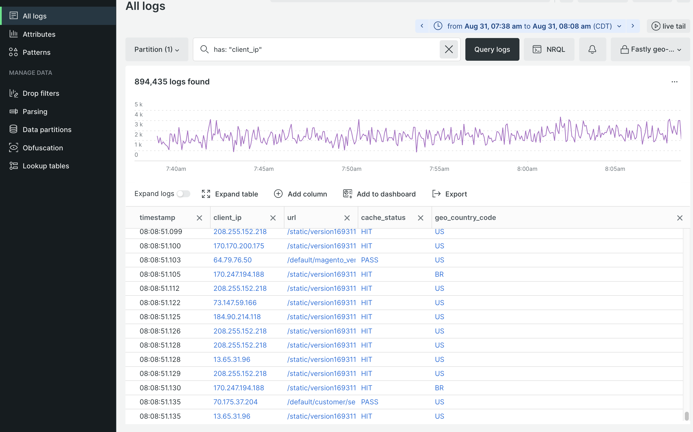

# Protokollverwaltung von New Relic

Alle Cloud-Infrastrukturprojekte umfassen [New Relic-Protokollverwaltung](https://docs.newrelic.com/docs/logs/get-started/get-started-log-management/). Der Dienst ist vorkonfiguriert, um alle Protokolldaten aus Ihren Staging- und Produktionsumgebungen zu aggregieren und in einem zentralen Protokollverwaltungs-Dashboard anzuzeigen.

Die aggregierten Daten enthalten Informationen aus den folgenden Logs:

- Alle `ece-tools`- und Anwendungsprotokolle aus dem Verzeichnis `~/var/log`
- Protokolle für Cloud-Services aus dem Verzeichnis `var/log/platform/<project-ID>`
- Schnelles CDN und WAF

Wenn Ihr Projekt mit New Relic verbunden ist, können Sie mit dem New Relic Logs-Dienst Aufgaben wie die folgenden ausführen:

- New Relic-Abfragen zum Durchsuchen aggregierter Protokolldaten verwenden
- Protokolldaten über die New Relic Logs-Anwendung visualisieren
- Benutzerdefinierte Diagramme, Dashboards und Warnhinweise erstellen
- Beheben von Leistungsproblemen in einem einzelnen Dashboard

## Protokolldaten anzeigen und analysieren

Verwenden Sie die New Relic Logs-Anwendung, um über die aggregierten Protokolldaten zu suchen und Fehler in Anwendungen, Infrastruktur, CDN und WAF zu beheben. Sie können Diagramme, Dashboards und Warnhinweise mithilfe von Protokolldaten erstellen, die von New Relic-APM- und Infrastrukturdiensten erfasst wurden.

**So verwenden Sie die New Relic Logs-Anwendung**:

1. Melden Sie sich bei Ihrem [New Relic-Konto](https://login.newrelic.com/login) an.

1. Wählen Sie **Protokolle** aus dem Navigationsmenü des Explorers aus.

1. Stellen Sie sicher, dass Ihr Konto oben in der Ansicht &quot;_Alle Protokolle_&quot;ausgewählt ist.

1. Wählen Sie einen Zeitraum für die Logs-Abfrage aus.

1. Um Infrastrukturprotokolldaten für Cloud-Services (Protokolle von `~/var/log/`) zu überprüfen, geben Sie die Abfragezeichenfolge `has: "filePath"` in das Feld _Suche nach Protokollen_ ein. Klicken Sie dann auf **[!UICONTROL Query logs]**.

   Die Namen der Protokolldateien werden in der Spalte `filePath` mit vollständigen Pfaden zur Protokolldatei gespeichert.

   

1. Geben Sie die Abfragezeichenfolge `has: "client_ip"` in das Feld _Suche nach Protokollen_ ein, um die Fastly-Protokolldaten zu überprüfen. Klicken Sie dann auf **[!UICONTROL Query logs]**.

1. Um die Ergebnisse des Schnellprotokolls nach Ländercode zu filtern, klicken Sie auf **[!UICONTROL Add column]** und wählen Sie dann **[!UICONTROL geo_country_code]** aus.

   

>[!TIP]
>
>Sie können die Abfrageansicht aus dem Dropdown-Menü _Gespeicherte Ansichten_ speichern. Klicken Sie auf &quot;**[!UICONTROL Create new]**&quot;, geben Sie einen Namen ein, wählen Sie Optionen aus und klicken Sie auf &quot;**[!UICONTROL Save view]**&quot;.
>
>Siehe [Erste Schritte mit der Protokollverwaltung](https://docs.newrelic.com/docs/logs/get-started/get-started-log-management/) und [Einführung in die New Relic-Abfragesprache](https://docs.newrelic.com/docs/query-your-data/nrql-new-relic-query-language/get-started/introduction-nrql-new-relics-query-language/) auf der Seite _New Relic Docs_ .
