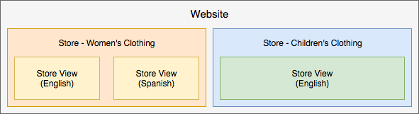

# Best Practices für die Store-Konfiguration

Detaillierte Informationen zum Konfigurieren von Stores, Sites und Websites finden Sie im [Adobe Commerce-Benutzerhandbuch](https://experienceleague.adobe.com/docs/commerce-admin/user-guides/home.html). Auf dieser Seite finden Sie Best Practices, hilfreiche Informationen und Richtlinien zum Konfigurieren Ihrer Stores, Sites und mehr mit zusätzlichen Inhalten, die im Laufe der Zeit und über Versionen hinweg veröffentlicht werden können.

## Marketing-Kampagnen und -Promotions

Diese Informationen sind für Adobe Commerce in der Cloud-Infrastruktur 2.1.X und 2.2.X hilfreich.

Um Kampagnen und Promotions zu erstellen, erstellen Sie die Optionen und Einstellungen in [Inhaltstaging](https://experienceleague.adobe.com/docs/commerce-admin/content-design/staging/content-staging.html). Mit dieser Funktion können Sie Ihre Kampagnen erstellen und in der Vorschau anzeigen, bevor Sie sie für den Kundenverkauf veröffentlichen. Die folgenden Informationen enthalten hilfreiche Informationen. Weitere Informationen finden Sie in den verknüpften Inhalten des Adobe Commerce-Benutzerhandbuchs.

_Kampagnen_ sind Marketingereignisse für saisonale Verkäufe, neue Produktlinien und mehr. Jede Kampagne kann benutzerdefinierte Designs, Inhaltsbausteine, Widgets zur Steuerung und Anzeige von Inhalten sowie mit Preisregeln verknüpfte Promotions enthalten. Aufgrund der umfangreichen Natur einer Kampagne können Sie sie mit einem Start- und Enddatum über die Inhaltstaging-Phase erstellen.

_Promotions_ bieten Rabatte, einmalige Angebote, Gutscheine, Erstkäuferanreize und mehr. Sie erstellen diese Promotions als _Preisregeln_ , die die Bedingungen, Rabatte und Optionen festlegen, mit denen Kunden zum Kauf ermutigt werden. Sie können Preisregeln für den [Warenkorb](https://experienceleague.adobe.com/docs/commerce-admin/marketing/promotions/cart-rules/price-rules-cart.html) oder den [Katalog](https://experienceleague.adobe.com/docs/commerce-admin/marketing/promotions/catalog-rules/price-rules-catalog.html) mit zusätzlichen Optionen für Banner, Belohnungspunkte und mehr erstellen. Sie können Kampagnen für Ihre Promotions planen, indem Sie Preisregeln für wichtige Ereignisse wie eine neue Produktlinie oder saisonale Verkäufe anwenden.

Im Folgenden finden Sie Tipps zum Erstellen, Aktualisieren und Verwalten von Promotions und Kampagnen:

* Eine Promotion kann Teil einer Kampagne sein. Eine Kampagne kann nicht Teil einer Promotion sein. Sie können Listen mit Promotions als Preisregeln haben, die mehrmals mit mehreren Kampagnen verwendet werden.
* Wenn Sie eine Promotion erstellen, wird immer eine anfängliche Kampagne erstellt, die inaktiv ist. Es hat ein Startdatum, aber kein Enddatum. Sie können diese anfängliche Kampagne ignorieren. Sie können ein neues Update mit dem richtigen Kampagnenkalender planen und aktivieren.
* Eine Kampagne hat ein Start- und ein Enddatum, keine Promotion. Die Planung, die beim Erstellen einer Promotion erscheint, konfiguriert nicht das Start- und Enddatum der Promotion. Damit können Sie eine Kampagne für diese Promotion planen, während Sie sich auf der Konfigurationsseite der Promotion befinden.
* Sie können die Bearbeitung im gestaffelten Inhalt nicht direkt durchführen. Wenn Sie Einstellungen und Optionen in der Kampagne bearbeiten müssen, bearbeiten Sie das Original oder eine Replikation und überschreiben Sie diese in &quot;Staged Content&quot;. Wenn Sie beispielsweise kein Enddatum für eine Kampagne haben, müssen Sie das Original bearbeiten und die Push-Benachrichtigung aktualisieren.

## Erweiterte Preise und gestaffelte Inhalte

Diese Informationen sind für Adobe Commerce in der Cloud-Infrastruktur 2.1.X und 2.2.X hilfreich.

In der Regel können Sie [Erweiterte Preise](https://experienceleague.adobe.com/docs/commerce-admin/catalog/products/pricing/pricing-advanced.html) für Produkte über den Bereich **Produkte** > **Kataloge** des Administrators festlegen. Führen Sie mit Staged Content einige zusätzliche Schritte aus, um die Preise einer Promotion und Kampagne hinzuzufügen.

So bearbeiten Sie erweiterte Preise und aktualisieren die Inhaltstaging-Umgebung:

1. Melden Sie sich beim Administrator an.
1. Navigieren Sie zu **Produkte** > **Katalog** und wählen Sie ein Produkt aus und bearbeiten Sie es.
1. Wählen Sie auf der Registerkarte &quot;Preise&quot;die Option **Erweiterte Preise**. Bearbeiten Sie den Preis und speichern Sie die Änderungen.
1. Klicken Sie oben auf der Seite auf **Neues Update planen**.
1. Erstellen Sie eine Promotion für das Produkt.
1. Füllen Sie die Promotion-Informationen aus. Geben Sie für die Planung ein Anfangs- und Enddatum und eine Endzeit ein.
1. Speichern Sie die Promotion. Es wird eine inaktive Anfangskampagne erstellt.
1. Sie können eine Vorschau anzeigen, um den Sonderpreis, den Promotionsnamen, den regulären Preis und den geplanten Datumsbereich für die Kampagne zu überprüfen.

Für weitere Schritte können Sie mit Anweisungen mit [Änderungen für Katalogpreisregeln planen](https://experienceleague.adobe.com/docs/commerce-admin/marketing/promotions/catalog-rules/price-rule-catalog-scheduled-changes.html) fortfahren. Klicken Sie auf **Weiter** , um durch die Schritte zu gehen.

## Preisregeln

Preisregeln können Logik und Bedingungen beinhalten, die genauso unbegrenzt sind wie Ihre Marketing-Fantasie. Zu den beliebten Beispielen zählen &quot;Buy One Gratis&quot;, &quot;Buy One Get One One One 50% Off&quot;, &quot;25 Dollar Rabatt auf Bestellungen über 100 Dollar&quot;und mehr.

Informationen zum Erstellen einer Preisregel finden Sie im [Adobe Commerce-Benutzerhandbuch](https://experienceleague.adobe.com/docs/commerce-admin/marketing/promotions/catalog-rules/price-rules-catalog-create.html).

Im Folgenden finden Sie ein Beispiel für die Erstellung einer Preisregel für den Rabatt &quot;Nur erste Bestellung&quot;. Für diesen Rabatt möchten Sie:

* Erstellen Sie eine Preisregel mit einem [Kundensegment](https://docs.magento.com/user-guide/marketing/customer-segment-price-rule.html) mit einer Bedingung: Gesamtanzahl der Bestellungen unter 1
* Fügen Sie dieses Kundensegment als Bedingung zur Warenkorbregel hinzu
* Optional - Fügen Sie Bedingungen und Regeln hinzu, um die Rabatte auf bestimmte SKUs oder Produktkategorien für gezielte Käufe anzuwenden

Dadurch wird sichergestellt, dass Neukunden oder Bestandskunden, die noch keinen Kauf getätigt haben, den Rabatt nur auf ihre erste Bestellung erhalten. Sie können Banner erstellen und E-Mail-Promotions für den Erstkauf-Rabatt senden.

## Store-Ansichten

Sie können mehrere Stores mit einer einzigen Implementierung von Adobe Commerce in der Cloud-Infrastruktur einrichten und ausführen. Siehe [Einrichten mehrerer Websites oder Stores](multiple-sites.md).

Für Stores, die nicht miteinander interagieren, können Sie mehrere _Websites_ erstellen. Jede Website enthält bestimmte Artikel, Kundendaten, Checkout- und Warenkorb-Artikel, die nicht für andere Websites in Adobe Commerce freigegeben sind.

Jede Website kann einen oder mehrere _Stores_ mit verschiedenen Kategorien und Artikeln, freigegebenen Kundendaten, Checkout und Warenkorb enthalten. Für diese Geschäfte kann sich ein Kunde einmal anmelden und verschiedene Produktkataloge mit einem einzigen Kassengang einkaufen.

Außerdem können Sie _Ansichten speichern_ für verschiedene Sprachen, Layouts und Designs erstellen. Jede Ansicht kann über eine separate Domäne, ein Branding und eine separate Sprache verfügen, während Artikel, Kundendaten, Checkout und Warenkorb freigegeben werden.

Im Folgenden finden Sie Beispiele zur besseren Erläuterung:

* Einzelne Website mit einem Store und zwei Ansichten für Englisch und Spanisch Gebietsschema. Alle Artikeldaten, Kunden, Checkout und Warenkorb werden freigegeben.

  

* Eine einzelne Website mit einem Geschäft für Damenbekleidung umfasst zwei Ansichten: eine für Englisch und eine für Spanisch. Der Laden für Kinderbekleidung beinhaltet eine Einzelhandelsansicht in englischer Sprache. Alle Artikeldaten, Kunden, Checkout und Warenkorb werden freigegeben. Die Geschäfte können unterschiedliche Domänen und Designs haben.

  

* Zwei Websites: eine für Kleidung und eine andere für Heimarbeit mit verschiedenen Katalogen und separaten Artikeln, Kundendaten und Warenkorb. Jede Website kann nur innerhalb dieser Website über mehrere Stores und Ansichten verfügen, die Artikel, Kundendaten, Checkout und Warenkorb teilen.

  

>[!WARNING]
>
>Die Katalogdaten werden mit der Erhöhung der Anzahl der Websites und Stores erweitert. Abhängig von Ihrer Projektarchitektur können die zusätzlichen Stores zu einem längeren Indizierungsprozess und langsameren Reaktionszeiten für nicht zwischengespeicherte Katalogseiten führen. Adobe empfiehlt, dass Sie die Site-Leistung genau überwachen.
