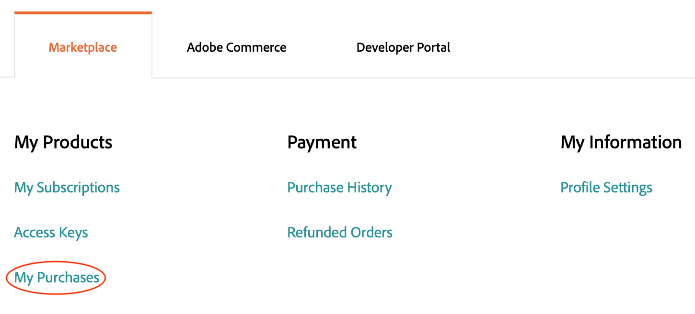

# Erweiterungen verwalten

Sie können Ihre Adobe Commerce-Anwendungsfunktionen erweitern, indem Sie eine Erweiterung vom [Commerce Marketplace](https://marketplace.magento.com) hinzufügen. Sie können beispielsweise ein Design hinzufügen, um das Erscheinungsbild Ihrer Storefront zu ändern, oder Sie können ein Sprachpaket hinzufügen, um Ihre Storefront und Ihren Administrator zu lokalisieren.

>[!NOTE]
>
>Um Installationsprobleme zu vermeiden, müssen alle Marketplace-Käufe mit demselben Konto (MAGEID) abgeschlossen werden, das Eigentümer des Cloud-Projekts ist.

## Name des Komponisten einer Erweiterung

Obwohl dieser Abschnitt beschreibt, wie der Composer-Name und die Version einer Erweiterung von Commerce Marketplace abgerufen werden können, können Sie den Namen und die Version des Moduls _any_ in der Composer-Datei des Moduls finden. Öffnen Sie die Datei `composer.json` in einem Texteditor und notieren Sie sich die Werte `"name"` und `"version"` .

**Abrufen des Komponentennamens eines Moduls von der Commerce Marketplace**:

1. Melden Sie sich bei [Commerce Marketplace](https://marketplace.magento.com) mit dem Benutzernamen und dem Kennwort an, mit dem Sie die Komponente gekauft haben.

1. Klicken Sie oben rechts auf Ihren Benutzernamen und wählen Sie **Mein Profil** aus.

   

1. Klicken Sie auf der Seite _Mein Konto_ auf **Meine Käufe**.

   

1. Wählen Sie auf der Seite _Meine Einkäufe_ ein von Ihnen erworbenes Modul aus und klicken Sie auf **Technische Details**.

1. Klicken Sie auf **Kopieren** , um die [!UICONTROL Component name] in die Zwischenablage zu kopieren.

1. Öffnen Sie einen Texteditor, fügen Sie den Komponentennamen ein und fügen Sie ein Doppelpunkt-Zeichen (`:`) hinzu.

1. Klicken Sie in **Technische Details** auf **Kopieren** , um den [!UICONTROL Component version] in die Zwischenablage zu kopieren.

1. Hängen Sie im Texteditor die Versionsnummer an den Komponentennamen nach dem Doppelpunkt an. Beispiel:

   ```text
   extension-name/magento2:1.0.1
   ```

## Installieren einer Erweiterung

Adobe empfiehlt, in einer Entwicklungsverzweigung zu arbeiten, wenn Sie Ihrer Implementierung eine Erweiterung hinzufügen. Beim Installieren einer Erweiterung wird der Erweiterungsname (`<VendorName>_<ComponentName>`) automatisch in die Datei [`app/etc/config.php`](https://experienceleague.adobe.com/docs/commerce-operations/configuration-guide/files/deployment-files.html) eingefügt. Die Datei muss nicht direkt bearbeitet werden.

**So installieren Sie eine Erweiterung**:

1. Wechseln Sie auf Ihrer lokalen Workstation zum Projektverzeichnis.

1. Erstellen oder checken Sie einen Entwicklungszweig aus. Siehe [Verzweigung](../development/cli-branches.md).

1. Fügen Sie unter Verwendung des Composer-Namens und der Version die Erweiterung zum Abschnitt &quot;`require`&quot;der Datei &quot;`composer.json`&quot;hinzu.

   ```bash
   composer require <extension-name>:<version> --no-update
   ```

1. Aktualisieren Sie die Projektabhängigkeiten.

   ```bash
   composer update
   ```

1. Hinzufügen, Übertragen und Push-Code-Änderungen.

   ```bash
   git add -A
   ```

   ```bash
   git commit -m "Install <extension-name>"
   ```

   ```bash
   git push origin <branch-name>
   ```

   >[!WARNING]
   >
   >Bei der Installation einer Erweiterung müssen Sie die Datei `composer.lock` einbeziehen, wenn Sie Code-Änderungen an die Remote-Umgebung senden. Der Befehl `composer install` liest die Datei `composer.lock`, um die definierten Abhängigkeiten in der Remote-Umgebung zu aktivieren.

1. Nachdem der Build und die Bereitstellung abgeschlossen sind, melden Sie sich mit einer SSH bei der Remote-Umgebung an und überprüfen Sie die installierte Erweiterung.

   ```bash
   bin/magento module:status <extension-name>
   ```

   Ein Erweiterungsname verwendet das folgende Format: `<VendorName>_<ComponentName>`.

   Beispielantwort:

   ```
   Module is enabled
   ```

   Wenn Bereitstellungsfehler auftreten, lesen Sie [Fehler bei der Bereitstellung der Erweiterung](../deploy/recover-failed-deployment.md).

## Erweiterungen verwalten

Wenn Sie eine Erweiterung mit Composer hinzufügen, aktiviert der Bereitstellungsprozess die Erweiterung automatisch. Wenn Sie die Erweiterung bereits installiert haben, können Sie sie über die CLI aktivieren oder deaktivieren. Verwenden Sie beim Verwalten von Erweiterungen das folgende Format: `<VendorName>_<ComponentName>`

Aktivieren oder deaktivieren Sie niemals eine Erweiterung, während Sie in den Remote-Umgebungen angemeldet sind.

**So aktivieren oder deaktivieren Sie eine Erweiterung**:

1. Wechseln Sie auf Ihrer lokalen Workstation zum Projektverzeichnis.

1. Aktivieren oder deaktivieren Sie ein Modul. Der Befehl `module` aktualisiert die Datei `config.php` mit dem angeforderten Status des Moduls.

   >Aktivieren Sie ein Modul.

   ```bash
   bin/magento module:enable <module-name>
   ```

   >Deaktivieren Sie ein Modul.

   ```bash
   bin/magento module:disable <module-name>
   ```

1. Wenn Sie ein Modul aktiviert haben, verwenden Sie `ece-tools` , um die Konfiguration zu aktualisieren.

   ```bash
   ./vendor/bin/ece-tools module:refresh
   ```

1. Überprüfen Sie den Status eines Moduls.

   ```bash
   bin/magento module:status <module-name>
   ```

1. Hinzufügen, Übertragen und Push-Code-Änderungen.

   ```bash
   git add -A
   ```

   ```bash
   git commit -m "Disable <extension-name>"
   ```

   ```bash
   git push origin <branch-names>
   ```

## Aktualisierung einer Erweiterung

Bevor Sie fortfahren, benötigen Sie den Composer-Namen und die Version für die Erweiterung. Überprüfen Sie außerdem, ob die Erweiterung mit Ihrem Projekt und Ihrer Adobe Commerce-Version kompatibel ist. Überprüfen Sie insbesondere [ die erforderliche PHP-Version](https://experienceleague.adobe.com/docs/commerce-operations/installation-guide/system-requirements.html), bevor Sie beginnen.

**Aktualisieren einer Erweiterung**:

1. Wechseln Sie auf Ihrer lokalen Workstation zum Projektverzeichnis.

1. Erstellen oder checken Sie einen Entwicklungszweig aus. Siehe [Verzweigung](../development/cli-branches.md).

1. Öffnen Sie die Datei &quot;`composer.json`&quot; in einem Texteditor.

1. Suchen Sie Ihre Erweiterung und aktualisieren Sie die Version.

1. Speichern Sie Ihre Änderungen und beenden Sie den Texteditor.

1. Aktualisieren Sie die Projektabhängigkeiten.

   ```bash
   composer update
   ```

1. Fügen Sie Code-Änderungen hinzu, übertragen Sie sie und übertragen Sie sie.

   ```bash
   git add -A
   ```

   ```bash
   git commit -m "Update <extension-name>"
   ```

   ```bash
   git push origin <branch-names>
   ```

Wenn Fehler auftreten, lesen Sie [Wiederherstellen aus Komponentenfehler](../deploy/recover-failed-deployment.md). Weitere Informationen zur Verwendung von Erweiterungen mit Adobe Commerce finden Sie unter [Erweiterungen](https://experienceleague.adobe.com/docs/commerce-admin/start/resources/extensions.html) im _Administratorhandbuch_.
