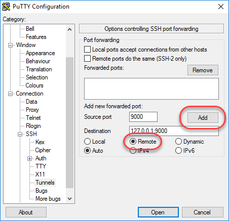

# Xdebug konfigurieren

[!DNL Xdebug] ist eine Erweiterung für das Debugging von PHP. Obwohl Sie eine IDE Ihrer Wahl verwenden können, wird im Folgenden beschrieben, wie Sie [!DNL Xdebug] und [!DNL PhpStorm] zum Debugging in Ihrer lokalen Umgebung.

>[!NOTE]
>
>Sie können [!DNL Xdebug] , um in der Cloud Docker-Umgebung für lokales Debugging auszuführen, ohne die Projektkonfiguration für die Cloud-Infrastruktur in Adobe Commerce zu ändern. Siehe [Xdebug für Docker konfigurieren](https://developer.adobe.com/commerce/cloud-tools/docker/test/configure-xdebug/).

Aktivieren [!DNL Xdebug]müssen Sie eine Datei in Ihrem Git-Repository konfigurieren, Ihre IDE konfigurieren und die Anschlussweiterleitung einrichten. Sie können einige Einstellungen im Abschnitt `magento.app.yaml` -Datei. Push nach der Bearbeitung die Git-Änderungen über alle Starter-Umgebungen und Pro-Integrationsumgebungen hinweg, um [!DNL Xdebug]. [!DNL Xdebug] ist bereits in Pro Staging- und Produktionsumgebungen verfügbar.

Nach der Konfiguration können Sie CLI-Befehle, Webanfragen und Code debuggen. Beachten Sie, dass alle Cloud-Infrastrukturumgebungen schreibgeschützt sind. Klonen Sie den Code in Ihrer lokalen Entwicklungsumgebung, um das Debugging durchzuführen. Informationen zu Staging- und Produktionsumgebungen für Pro finden Sie unter [zusätzliche Anweisungen](#debug-for-pro-staging-and-production) für [!DNL Xdebug].

## Voraussetzungen

So führen Sie und verwenden [!DNL Xdebug]benötigen Sie die SSH-URL für die Umgebung. Sie können die Informationen über die [[!DNL Cloud Console]](../project/overview.md) oder [!DNL Cloud Onboarding UI].

## Xdebug konfigurieren

So konfigurieren Sie [!DNL Xdebug]führen Sie die folgenden Schritte aus:

- [Arbeiten in einer Verzweigung zum Push von Dateiaktualisierungen](#get-started-with-a-branch)
- [Aktivieren [!DNL Xdebug] für Umgebungen](#enable-xdebug-in-your-environment)
- [IDE konfigurieren](#configure-phpstorm)
- [Einrichten der Anschlussweiterleitung](#set-up-port-forwarding)

### Erste Schritte mit einer Verzweigung

Hinzufügen von [!DNL Xdebug]empfiehlt Adobe, in [eine Entwicklungsverzweigung](../dev-tools/cloud-cli-overview.md#create-an-environment-branch).

### Aktivieren Sie Xdebug in Ihrer Umgebung

Sie können [!DNL Xdebug] direkt in alle Starter-Umgebungen und Pro-Integrationsumgebungen. Dieser Konfigurationsschritt ist nicht für Pro Production- und Staging-Umgebungen erforderlich. Siehe [Debug für Pro Staging und Produktion](#debug-for-pro-staging-and-production).

Aktivieren [!DNL Xdebug] Fügen Sie für Ihr Projekt `xdebug` der `runtime:extensions` Abschnitt `.magento.app.yaml` -Datei.

**Aktivieren von Xdebug**:

1. Öffnen Sie in Ihrem lokalen Terminal den `.magento.app.yaml` in einem Texteditor.

1. Im `runtime` Abschnitt `extensions`, hinzufügen `xdebug`. Beispiel:

   ```yaml
   runtime:
       extensions:
           - redis
           - xsl
           - newrelic
           - sodium
           - xdebug
   ```

1. Speichern Sie Ihre Änderungen in der `.magento.app.yaml` und beenden Sie den Texteditor.

1. Fügen Sie die Änderungen hinzu, übertragen und pushen Sie sie, um sie erneut bereitzustellen.

   ```bash
   git add -A
   ```

   ```bash
   git commit -m "Add xdebug"
   ```

   ```bash
   git push origin <environment-ID>
   ```

Bei der Bereitstellung in Starter-Umgebungen und Pro-Integrationsumgebungen [!DNL Xdebug] ist jetzt verfügbar. Fahren Sie mit der Konfiguration Ihrer IDE fort. Informationen zu PHPStorm finden Sie unter [PHPStorm konfigurieren](#configure-phpstorm).

### PHPStorm konfigurieren

Die [PHPStorm](https://www.jetbrains.com/phpstorm/) IDE muss so konfiguriert sein, dass sie ordnungsgemäß mit [!DNL Xdebug].

**So konfigurieren Sie PhpStorm für die Verwendung mit Xdebug**:

1. Öffnen Sie in Ihrem PhpStorm-Projekt das **Einstellungen** Bedienfeld.

   - _macOS_—select **PHPStorm** > **Voreinstellungen**.
   - _Windows/Linux_—select **Datei** > **Einstellungen**.

1. Im _Einstellungen_ Bedienfeld, erweitern und suchen Sie **Sprachen und Frameworks** > **PHP** > **Server** Abschnitt.

1. Klicken Sie auf **+** , um eine Serverkonfiguration hinzuzufügen. Oben ist der Projektname grau.

1. [Optional] Konfigurieren Sie die folgenden Einstellungen für die neue Serverkonfiguration. Siehe [Kein Debugserver konfiguriert](https://www.jetbrains.com/help/phpstorm/troubleshooting-php-debugging.html#no-debug-server-is-configured) im _PHPStorm_ Dokumentation.

   - **Name**—Geben Sie den gleichen Namen ein wie der Hostname. Dieser Wert muss mit dem Wert für `PHP_IDE_CONFIG` in [CLI-Befehle debuggen](#debug-cli-commands) , um CLI zum Debugging zu verwenden.
   - **Host**—Geben Sie den Hostnamen ein.
   - **Port**—Enter `443`.
   - **Debugger**—select `Xdebug`.

1. Auswählen **Pfadzuordnungen verwenden**. Im _Datei/Verzeichnis_ -Bereich, der Stamm des Projekts für `serverName` angezeigt.

1. Im **Absoluter Pfad auf dem Server** klicken Sie auf die **Bearbeiten** und fügen Sie eine Einstellung hinzu, die auf der Umgebung basiert.

   - Für alle Starter-Umgebungen und Pro-Integrationsumgebungen lautet der Remote-Pfad `/app`.
   - Für Staging- und Produktionsumgebungen:

      - Produktion: `/app/<project_code>/`
      - Staging:  `/app/<project_code>_stg/`

1. Ändern Sie die [!DNL Xdebug] Port 9000 im **Sprachen und Frameworks** > **PHP** > **Debuggen** > **Xdebug** > **Debug-Port** Bedienfeld.

1. Klicks **Anwenden**.

### Einrichten der Anschlussweiterleitung

Ordnen Sie die `XDEBUG` Verbindung vom Server zu Ihrem lokalen System. Für jede Art von Debugging müssen Sie Port 9000 von Ihrem Adobe Commerce auf dem Cloud-Infrastrukturserver an Ihren lokalen Computer weiterleiten. Siehe einen der folgenden Abschnitte:

- [Anschlussweiterleitung auf Mac oder UNIX](#port-forwarding-on-mac-or-unix)
- [Anschlussweiterleitung unter Windows](#port-forwarding-on-windows)

#### Anschlussweiterleitung auf Mac oder UNIX®

**So richten Sie die Anschlussweiterleitung in einer Mac- oder UNIX®-Umgebung ein**:

1. Öffnen Sie ein Terminal.

1. Verwenden Sie SSH, um die Verbindung herzustellen.

   ```bash
   ssh -R 9000:localhost:9000 <ssh url>
   ```

   Verwenden Sie die `-v` (ausführliche) Option, sodass ein Socket immer dann im Terminal angezeigt wird, wenn er mit dem weitergeleiteten Port verbunden ist.

   Wenn der Fehler &quot;Verbindung nicht möglich&quot;oder &quot;Anschluss auf Remote-Server konnte nicht überwacht werden&quot;angezeigt wird, kann es zu einer weiteren aktiven SSH-Sitzung kommen, die auf dem Server, der Port 9000 belegt, fortbesteht. Wenn diese Verbindung nicht verwendet wird, können Sie sie beenden.

**Fehlerbehebung bei der Verbindung**:

1. Verwenden Sie SSH, um sich bei der Remote-Integration, Staging- oder Produktionsumgebung anzumelden.

1. Anzeigen einer Liste von SSH-Sitzungen: `who`

1. Vorhandene SSH-Sitzungen nach Benutzer anzeigen. Achten Sie darauf, einen anderen Benutzer als Sie nicht zu beeinträchtigen!

   - integration: Benutzernamen ähneln `dd2q5ct7mhgus`
   - Staging: Benutzernamen ähneln `dd2q5ct7mhgus_stg`
   - Produktion: Benutzernamen ähneln `dd2q5ct7mhgus`

1. Für eine Benutzersitzung, die älter als Ihre ist, suchen Sie den Pseudo-Terminal-Wert (PTS), z. B. `pts/0`.

1. Beenden Sie die Prozess-ID (PID), die dem PTS-Wert entspricht.

   ```bash
   ps aux | grep ssh
   kill <PID>
   ```

   Beispielantwort:

   ```terminal
   dd2q5ct7mhgus        5504  0.0  0.0  82612  3664 ?      S    18:45   0:00 sshd: dd2q5ct7mhgus@pts/0
   ```

   Um die Verbindung zu beenden, geben Sie einen Befehl zum Abbrechen mit der Prozess-ID (PID) ein.

   ```bash
   kill 3664
   ```

#### Anschlussweiterleitung unter Windows

Um die Anschlussweiterleitung (SSH-Tunnel) unter Windows einzurichten, müssen Sie Ihre Windows Terminal-Anwendung konfigurieren. In diesem Beispiel wird die Erstellung eines SSH-Tunnels mithilfe von [Putty](https://www.chiark.greenend.org.uk/~sgtatham/putty/latest.html). Sie können andere Anwendungen wie Cygwin verwenden. Weitere Informationen zu anderen Anwendungen finden Sie in der Dokumentation des Anbieters, die mit diesen Anwendungen bereitgestellt wird.

**Einrichten eines SSH-Tunnels unter Windows mithilfe von Putty**:

1. Sofern noch nicht geschehen, laden Sie [Putty](https://www.chiark.greenend.org.uk/~sgtatham/putty/latest.html).

1. Starten Sie Putty.

1. Klicken Sie im Bereich Kategorie auf **Sitzung**.

1. Geben Sie die folgenden Informationen ein:

   - **Hostname (oder IP-Adresse)** -Feld: Geben Sie die [SSH-URL](../development/secure-connections.md#connect-to-a-remote-environment) für Ihren Cloud-Server
   - **Port** field: Enter `22`

   

1. Im _Kategorie_ Bereich, klicken Sie auf **Verbindung** > **SSH** > **Tunnel**.

1. Geben Sie die folgenden Informationen ein:

   - **Quellport** field: Enter `9000`
   - **Ziel** field: Enter `127.0.0.1:9000`
   - Klicks **Remote**

1. Klicks **Hinzufügen**.

   

1. Im _Kategorie_ Bereich, klicken Sie auf **Sitzung**.

1. Im **Gespeicherte Sitzungen** Geben Sie einen Namen für diesen SSH-Tunnel ein.

1. Klicks **Speichern**.

   

1. Um den SSH-Tunnel zu testen, klicken Sie auf **Laden** Klicken Sie auf **Öffnen**.

   Wenn der Fehler &quot;Verbindung nicht möglich&quot;angezeigt wird, überprüfen Sie Folgendes:

   - Alle Pfadeinstellungen sind korrekt
   - Sie führen Putty auf dem Computer aus, auf dem sich Ihre privaten Adobe Commerce-SSH-Schlüssel in der Cloud-Infrastruktur befinden

## SSH-Zugriff auf Xdebug-Umgebungen

Zum Initiieren des Debuggens, zum Ausführen des Setups und mehr benötigen Sie die SSH-Befehle für den Zugriff auf die Umgebungen. Diese Informationen erhalten Sie über die [[!DNL Cloud Console]](../development/secure-connections.md#use-an-ssh-command) und Ihrer Projektübersicht.

Für Starter-Umgebungen und Pro-Integrationsumgebungen können Sie Folgendes verwenden: `magento-cloud` CLI-Befehl zum SSH in diesen Umgebungen:

```bash
magento-cloud environment:ssh --pipe -e <environment-ID>
```

Verwendung [!DNL Xdebug], SSH in die Umgebung wie folgt umbenannt:

```bash
ssh -R <xdebug listen port>:<host>:<xdebug listen port> <SSH-URL>
```

Beispiel:

```bash
ssh -R 9000:localhost:9000 pwga8A0bhuk7o-mybranch@ssh.us.magentosite.cloud
```

## Debug für Pro Staging und Produktion

>[!NOTE]
>
>In Pro-Staging- und Produktionsumgebungen, [!DNL Xdebug] ist immer verfügbar, da diese Umgebungen eine spezielle Einrichtung für [!DNL Xdebug]. Alle normalen Webanfragen werden an einen dedizierten PHP-Prozess weitergeleitet, der nicht über [!DNL Xdebug]. Daher werden diese Anforderungen normal verarbeitet und unterliegen nicht der Leistungsbeeinträchtigung, wenn [!DNL Xdebug] geladen wurde. Wenn eine Webanfrage gesendet wird, bei der die [!DNL Xdebug] Schlüssel, wird es zu einem separaten PHP-Prozess weitergeleitet, der [!DNL Xdebug] geladen.

Verwendung [!DNL Xdebug] speziell in der Staging- und Produktionsumgebung von Pro Plan erstellen Sie einen separaten SSH-Tunnel und eine Websitzung, auf die Sie nur Zugriff haben. Diese Nutzung unterscheidet sich von dem typischen Zugriff, der nur Ihnen und nicht allen Benutzern Zugriff gewährt.

Sie benötigen Folgendes:

- SSH-Befehle für den Zugriff auf die Umgebungen. Diese Informationen erhalten Sie über die [[!DNL Cloud Console]](../project/overview.md) oder [!DNL Cloud Onboarding UI].
- Die `xdebug_key` -Wert, der beim Konfigurieren der Staging- und Pro-Umgebungen festgelegt wird.

  Die `xdebug_key` kann mithilfe von SSH gefunden werden, um sich beim primären Knoten anzumelden und auszuführen:

  ```bash
  cat /etc/platform/*/nginx.conf | grep xdebug.sock | head -n1
  ```

**So richten Sie einen SSH-Tunnel zu einer Staging- oder Produktionsumgebung ein**:

1. Öffnen Sie ein Terminal.

1. Bereinigen Sie alle SSH-Sitzungen für jeden Webknoten des Clusters.

   ```bash
   ssh USERNAME@CLUSTER.ent.magento.cloud 'rm /run/platform/USERNAME/xdebug.sock'
   ```

1. Richten Sie den SSH-Tunnel für Xdebug für jeden Webknoten des Clusters ein.

   ```bash
   ssh -R /run/platform/USERNAME/xdebug.sock:localhost:9000 -N USERNAME@CLUSTER.ent.magento.cloud
   ```

**Starten des Debuggens mithilfe der Umgebungs-URL**:

1. Aktivieren Sie das Remote-Debugging. Besuchen Sie die Site im Browser und hängen Sie Folgendes an die URL an, wo `KEY` der Wert für `xdebug_key`.

   ```http
   ?XDEBUG_SESSION_START=KEY
   ```

   Dieser Schritt setzt das Cookie, das Browseranforderungen an Trigger sendet [!DNL Xdebug].

1. Führen Sie das Debugging mit [!DNL Xdebug].

1. Wenn Sie bereit sind, die Sitzung zu beenden, verwenden Sie den folgenden Befehl, um das Cookie zu entfernen und das Debugging über den Browser, in dem `KEY` der Wert für `xdebug_key`.

   ```http
   ?XDEBUG_SESSION_STOP=KEY
   ```

   >[!NOTE]
   >
   >Die `XDEBUG_SESSION_START` weitergegeben von `POST` -Anfragen werden nicht unterstützt.

## CLI-Befehle debuggen

Dieser Abschnitt erläutert das Debugging von CLI-Befehlen.

Debugging von CLI-Befehlen:

1. SSH in den Server, den Sie mit CLI-Befehlen debuggen möchten.

1. Erstellen Sie die folgenden Umgebungsvariablen:

   ```bash
   export XDEBUG_CONFIG='PHPSTORM'
   ```

   ```bash
   export PHP_IDE_CONFIG="serverName=<name of the server that is configured in PHPSTORM>"
   ```

   Diese Variablen werden entfernt, wenn die SSH-Sitzung beendet wird.

1. Debugging beginnen

   Führen Sie in Starterumgebungen und Pro-Integrationsumgebungen den CLI-Befehl zum Debuggen aus.
Sie können Laufzeitoptionen hinzufügen, beispielsweise:

   ```bash
   php -d xdebug.profiler_enable=On -d xdebug.max_nesting_level=9999 bin/magento cache:clean
   ```

   In Pro Staging- und Produktionsumgebungen müssen Sie den Pfad zum [!DNL Xdebug] PHP-Konfigurationsdatei beim Debugging von CLI-Befehlen, z. B.:

   ```bash
   php -c /etc/platform/USERNAME/php.xdebug.ini bin/magento cache:clean
   ```

## Webanfragen debuggen

Die folgenden Schritte helfen Ihnen beim Debugging von Webanfragen.

1. Im _Erweiterung_ Menü, klicken **Debuggen** aktivieren.

1. Klicken Sie mit der rechten Maustaste, wählen Sie das Optionsmenü aus und setzen Sie den IDE-Schlüssel auf **PHPSTORM**.

1. Installieren Sie die [!DNL Xdebug] Client im Browser. Konfigurieren und aktivieren Sie es.

### Beispiel: Chrome-Einrichtung

In diesem Abschnitt wird die Verwendung von [!DNL Xdebug] in Chrome mit der [!DNL Xdebug] Helper-Erweiterung. Informationen zu [!DNL Xdebug] -Tools für andere Browser, lesen Sie die Browserdokumentation.

**So verwenden Sie Xdebug Helper mit Chrome**:

1. Erstellen Sie eine [SSH-Tunnel](#ssh-access-to-xdebug-environments) auf den Cloud-Server.

1. Installieren Sie die [Xdebug Helper-Erweiterung](https://chromewebstore.google.com/detail/eadndfjplgieldjbigjakmdgkmoaaaoc) aus dem Chrome Store.

1. Aktivieren Sie die Erweiterung in Chrome, wie in der folgenden Abbildung dargestellt.

   

1. Klicken Sie in Chrome mit der rechten Maustaste in der Chrome-Symbolleiste auf das grüne Helper-Symbol.

1. Klicken Sie im Popup-Menü auf **Optionen**.

1. Aus dem _IDE-Schlüssel_ Liste, klicken Sie **PHPStorm**.

1. Klicks **Speichern**.

   

1. Öffnen Sie Ihr PhpStorm-Projekt.

1. Klicken Sie in der oberen Navigationsleiste auf die **Listening beginnen** Symbol.

   Wenn die Navigationsleiste nicht angezeigt wird, klicken Sie auf **Ansicht** > **Navigationsleiste**.

1. Doppelklicken Sie im Navigationsfenster von PhpStorm auf die zu testende PHP-Datei.

## Lokalen Code debuggen

Aufgrund der schreibgeschützten Umgebungen müssen Sie Code aus einer Umgebung oder einer bestimmten Git-Verzweigung an die lokale Workstation ziehen, um das Debugging durchzuführen.

Die Methode, die Sie wählen, liegt bei Ihnen. Sie haben die folgenden Optionen:

- Checken Sie den Code aus Git aus und führen Sie `composer install`

  Diese Methode funktioniert nur, wenn `composer.json` referenziert Pakete in privaten Repositorys, auf die Sie keinen Zugriff haben. Diese Methode führt dazu, dass die gesamte Adobe Commerce-Codebase abgerufen wird.

- Kopieren Sie die `vendor`, `app`, `pub`, `lib`, und `setup` Verzeichnisse

  Diese Methode führt dazu, dass Sie sämtlichen Code haben, den Sie testen können. Je nachdem, wie viele statische Assets Sie haben, kann dies zu einer langen Übertragung mit einem großen Dateivolumen führen.

- Kopieren Sie die `vendor` nur Ordner

  Da der Großteil des Codes im `vendor` -Verzeichnis, wird diese Methode wahrscheinlich zu guten Tests führen, obwohl sie nicht die gesamte Codebasis testen.

**So komprimieren Sie Dateien und kopieren Sie sie auf Ihren lokalen Computer**:

1. Verwenden Sie SSH, um sich bei der Remote-Umgebung anzumelden.

1. Komprimieren Sie die Dateien.

   ```bash
   tar -czf /tmp/<file-name>.tgz <directory list>
   ```

   Um beispielsweise die `vendor` nur -Verzeichnis:

   ```bash
   tar -czf /tmp/vendor.tgz vendor
   ```

1. Verwenden Sie in Ihrer lokalen Umgebung PhpStorm, um die Dateien zu komprimieren.

   ```bash
   cd <phpstorm project root dir>
   ```

   ```bash
   rsync <SSH-URL>:/tmp/<file-name>.tgz .
   ```

   ```bash
   tar xzf <file-name>.tgz
   ```
