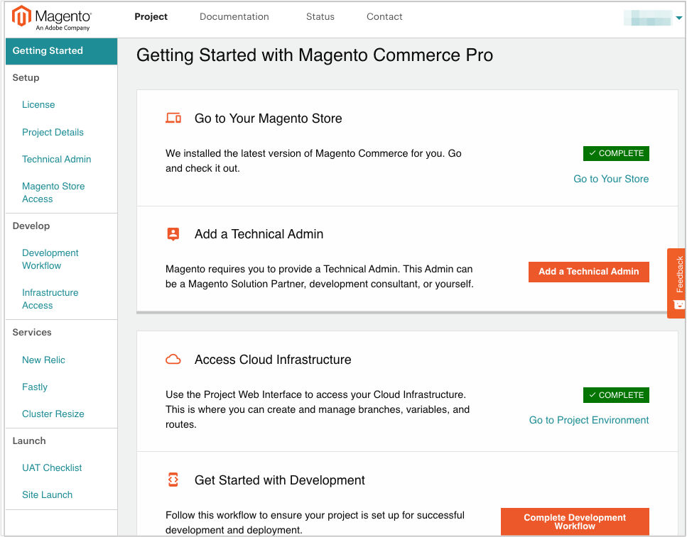

# [!DNL Onboarding] bis Commerce

Nachdem Adobe eine Commerce für das Cloud-Infrastrukturabonnement aktiviert hat, sind das ursprüngliche Projekt und der Codezugriff nur für die Person verfügbar, die als Lizenzinhaber (Kontoinhaber) bezeichnet wurde.

Der Lizenzinhaber ist die Person in Ihrem Unternehmens- oder Finanzunternehmen, die Zahlungen und andere geschäftsbezogene Transaktionen für das Adobe Commerce-Konto für Cloud-Infrastruktur verwaltet. Diese Person dient als Ansprechpartner für Adobe. Wenn Sie den Lizenzinhaber in Ihrem Konto ändern müssen, wenden Sie sich an Ihr Adobe Account Team.

Um Ihr Projekt schnell zu integrieren und mit der Entwicklung Ihrer Site für die Live-Bereitstellung beginnen zu können, müssen Sie die erforderlichen Einrichtungs- und [!DNL onboarding]-Aufgaben ausführen. In der Regel startet der Lizenzinhaber den Prozess, indem er den Administratorzugriff sichert und technische Admin-Benutzer erstellt, die bei der Einrichtung, Anpassung und Entwicklungsarbeit helfen können.

## Für ein Cloud-Konto anmelden

Wenn Sie kein Adobe Commerce-Konto für die Cloud-Infrastruktur haben, wenden Sie sich an [Vertrieb]. Wenn Sie sich anmelden, erstellt Adobe Ihr Konto und sendet Ihnen eine Begrüßungs-E-Mail mit Anweisungen zum Zugriff auf die Projektoberfläche. Die E-Mail enthält einen Link, über den Sie sich bei Ihrem Konto anmelden und Ihre erste Projekteinrichtung abschließen können.

### Cloud [!DNL Onboarding] -Benutzeroberfläche

Auf der Seite &quot;Adobe Commerce on Cloud Infrastructure Project&quot;in der Benutzeroberfläche ([!DNL Onboarding]) finden Sie eine Checkliste für die ersten Schritte, mit der Sie Ihr Projekt und Ihre Dienste einrichten, den Zugriff bestimmen und mit der Entwicklung beginnen können. Im OBUI haben Sie folgende Möglichkeiten:

- Fügen Sie einen technischen Administrator hinzu, einen Superuser, der Ihr Projekt und Ihre Verzweigungen verwalten kann.
- Zugriff auf Ihre Projektumgebung, einschließlich eines Links zum [!DNL Cloud Console]
- Führen Sie eine schnelle Benutzerakzeptanztest-Checkliste mit Links zu weiteren Tests durch.

**So öffnen Sie die Projektseite**:

1. Melden Sie sich bei Ihrem [Adobe Commerce-Kundenkonto](https://account.magento.com/customer/account/login) an.

1. Klicken Sie auf der Seite _Mein Konto_ auf die Registerkarte **[!UICONTROL Commerce]** , um die Projekte in Ihrem Konto anzuzeigen.

1. Klicken Sie auf **Projektseite anzeigen** im Abschnitt [Projekte](https://cloud.magento.com/cloud/project/).

1. Klicken Sie auf den Projektnamen und öffnen Sie die Seite Cloud-Projekt ([!DNL Onboarding] Benutzeroberfläche).

   

   Durchsuchen Sie das Portal nach hilfreichen Informationen und Optionen, um mit der Planung Ihres Projekts, der Entwicklung von Code und der Vorbereitung auf UAT und Site-Launch zu beginnen.

## Projekt aufrufen und Benutzer hinzufügen

Der Lizenzinhaber kann Benutzerkonten hinzufügen, um den Zugriff auf Code zu ermöglichen, Zweige zu verwalten, Tickets einzugeben und Umgebungen zu unterstützen. Diese Benutzerkonten können interne Entwicklungs-, Berater- und Lösungsspezialisten umfassen.

In der Regel ist der einzige Benutzer, den der Lizenzinhaber erstellen muss, der _Technische Admin_. Der technische Administrator benötigt ein Benutzerkonto mit Administratorzugriff, um Benutzerkonten für Entwickler zu erstellen, Umgebungsberechtigungen festzulegen und alle Zweige und Umgebungen zu verwalten. Der technische Administrator kann ein Entwickler, ein Berater, ein [Adobe Solution Partner](https://business.adobe.com/products/magento/partners.html) oder Sie selbst sein.

Sie können einen technischen Administrator über das Portal &quot;Projekt&quot;, über das Portal &quot;[!DNL Cloud Console]&quot;oder über die Befehlszeile mit der CLI &quot;`magento-cloud`&quot;erstellen.

### Benutzerregistrierung

Sie können Ihrer Adobe Commerce nur registrierte Benutzer für Cloud-Infrastrukturprojekte und -Umgebungen hinzufügen. Wenn Sie einen neuen Benutzer haben, bitten Sie ihn, sich für ein Konto zu registrieren ](https://account.magento.com/customer/account/login/) und die mit seinem Kontoprofil verknüpfte E-Mail-Adresse anzugeben.[

### Zugriff auf freigegebene Konten

Der Lizenzinhaber kann den freigegebenen Zugriff für das Konto einrichten. Mit dem freigegebenen Zugriff können vertrauenswürdige Mitarbeiter und Dienstleister das Help Center zum Senden und Verfolgen von Support-Tickets für Ihre Adobe Commerce in Cloud-Infrastrukturprojekten verwenden. Anweisungen zum Einrichten finden Sie im Artikel [Freigegebener Zugriff] im Hilfezentrum.

### [!DNL Cloud Console]

Sie können die [[!DNL Cloud Console]](cloud-console.md) verwenden, um Ihr Projekt zu verwalten, Benutzerkonten hinzuzufügen und mit der Entwicklung Ihres Stores zu beginnen. Lizenzinhaber, Benutzer technischer Administratoren und Entwickler können die [!DNL Cloud Console] verwenden, um alle Umgebungen und Zweige, Umgebungsvariablen, Umgebungseinstellungen und Routen zu verwalten.

**So greifen Sie auf den[!DNL Cloud Console]** zu:

1. Melden Sie sich bei [Mein Konto](https://account.magento.com/customer/account/login) an.

1. Klicken Sie auf der Seite _Mein Konto_ auf die Registerkarte **[!UICONTROL Commerce]** , um die Projekte in Ihrem Konto anzuzeigen.

1. Klicken Sie auf die Registerkarte **Projekte** und wählen Sie ein Projekt aus.

1. Klicken Sie auf **Infrastrukturzugriff** und dann auf **Projektzugriff (Web-Benutzeroberfläche)**.

   

## Für Adobe-Status anmelden

Rufen Sie Aktualisierungen zu Adobe Commerce in Cloud-Infrastrukturplattformumgebungen und zugehörigen Diensten von der [Statusseite] ab.

Die Seite bietet einen Status für Adobe Commerce-Komponenten und -Dienste, gefolgt von Benachrichtigungen zu Vorfällen, Service-Upgrades, geplanten Ausfällen und geplanter Wartung. Jeder, der an Ihrem Projekt arbeitet, kann die Adobe Commerce-Status-Site abonnieren, um Ereignisbenachrichtigungen und -aktualisierungen per E-Mail oder Slack zu erhalten. Sie können Ihr Adobe-Status-Abonnement anpassen, um bestimmte-Produkte nach Regionen und Ereignissen zu verfolgen.

>[!TIP]
>
> Öffnen Sie die neue [!DNL Cloud Console] und zeigen Sie die Projekt- und Umgebungsaktivitäten an.
>
>**Nächster Schritt**: [Anmelden bei Cl[!DNL ]oud Console](cloud-console.md)

<!-- link definitions -->

[Vertrieb]: https://business.adobe.com/products/magento/get-demo.html
[Freigegebener Zugriff]: https://experienceleague.adobe.com/docs/commerce-knowledge-base/kb/help-center-guide/magento-help-center-user-guide.html#shared-access
[Statusseite]: https://status.adobe.com/products/503473
